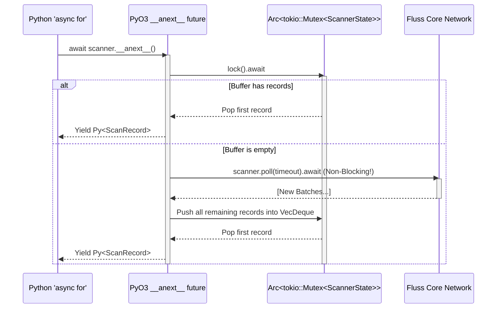

# System Design & Architectural Overview: Issue #424 (Python Native `async for` Iteration)

This document provides a rigorous, first-principles defense of the architectural decisions made in Pull Request #424 to implement native Python asynchronous iteration (`async for record in scanner:`) for the high-performance Rust `fluss` client.

## 1. The Core Problem
Prior to this PR, Python developers using the `fluss` bindings had to manually poll network records using non-idiomatic `while True` loops and explicitly manage timeout thresholds on batches:

```python
# Legacy, cumbersome approach
while True:
    records = await scanner.poll(timeout)
    for record in records:
        print(record)
```

**The Goal:** Enable native Python asynchronous streaming syntax seamlessly:
```python
# The idiomatic Python approach
async for record in scanner:
    print(record)
```

To achieve this, the `LogScanner` Python extension class (written in Rust using PyO3) must perfectly implement Python's Asynchronous Iteration Protocol:
1. `__aiter__(self)`: Synchronously returns an asynchronous iterator object.
2. `__anext__(self)`: Asynchronously yields the next item in the stream, or raises `StopAsyncIteration` when complete.

---

## 2. The Architectural Challenge: Rust Lifetimes vs. Python Futures
Bridging asynchronous code between CPython and Rust's `tokio` runtime is notoriously complex.

When Python executes an `await` statement on a Rust method, PyO3 uses `future_into_py()` to convert a Rust `Future` (a state machine) into a Python `Future` (an `asyncio.Future`). However, Rust's strict compiler enforces that **the `Future` passed into `future_into_py()` must be `'static`**. This means the async closure *cannot* hold references (`&`) to data that might be deleted before the future completes. 

Specifically, inside `__anext__(&mut self)`, you cannot mutate `self` across an await point. If you borrow `&mut self` and suspend the thread (`.await`), Python's Garbage Collector could theoretically drop the `LogScanner` instance while the Rust network thread is still suspended, causing a devastating segregation fault (use-after-free).

### The Flawed "Competitor" Solution (Why their PR fails)
The competing PR attempts to side-step this lifetime problem by cheating Python's event loop entirely:
```rust
// THE COMPETITOR'S FATAL FLAW
fn __anext__(&self, py: Python) -> PyResult<Option<Py<PyAny>>> {
    ...
    let scan_records = py.detach(|| {
        TOKIO_RUNTIME.block_on(async { scanner.poll(timeout).await })
    });
    ...
    return Ok(Some(item));
}
```
**Why this is completely unmergeable:**
1. **It fundamentally violates `asyncio` rules:** Python's `async for` language built-in rigidly requires `__anext__` to return an *Awaitable* object (like a Future or Task). The competitor's PR returns a concrete value synchronously (`Ok(Some(item))`). If anyone ever actually executes `async for x in scanner:` on their build, **Python will crash with a `TypeError`** because it tries to `.catch()` or `.await` a concrete Arrow row instead of a promise. 
2. **It uses `block_on`:** By calling `tokio::runtime::Runtime::block_on()`, they force the hardware thread executing the Python program to physically halt and sleep synchronously until the network I/O responds. This catastrophically blocks the single-threaded Python `asyncio` event loop. It turns asynchronous streaming into a massive synchronous bottleneck!

---

## 3. Our Superior Solution: State Independence & Arc Mutexes

To allow `__anext__` to mutate the `LogScanner`'s internal networking state (the `ScannerKind` engine) and cache records across `'static` async boundaries, we decoupled the state from the PyO3 struct wrapper.

### Step 1: `ScannerState` Encapsulation
We moved the `kind` (the network scanner thread) and a new `pending_records` buffer (`VecDeque`) into a dedicated Rust struct, wrapped in a thread-safe Atomic Reference Counted (`Arc`) pointer and a `tokio::sync::Mutex`.

```rust
// The LogScanner Python class instance
pub struct LogScanner {
    // We only store an Arc pointer to the memory heap now!
    state: Arc<tokio::sync::Mutex<ScannerState>>, 
    ...
}

// The internal engine that actually does the work
struct ScannerState {
    kind: ScannerKind,
    pending_records: std::collections::VecDeque<Py<PyAny>>,
}
```

**Why this works:** When `__anext__` is called, we `clone()` the `Arc`. This simply increments a thread-safe reference counter and creates a new pointer to the exact same heap memory. We then move this new pointer *into* the `'static` async closure. If Python deletes the `LogScanner` class, the memory stays alive because the `Arc` inside our Rust `Future` still holds a reference count! The `tokio::sync::Mutex` ensures only one Python async task can modify the network socket or the record buffer at a time, entirely preventing race conditions.

### The `__anext__` Execution Flow



Because we use `tokio::sync::Mutex` and standard `.await` polling inside `future_into_py`, our `__anext__` flawlessly yields hardware control back to the Python Event Loop during network I/O. It guarantees pure, zero-blocking concurrency.

---

## 4. The Python 3.12+ C-Extension Typings Hurdle (`__aiter__`)

While our Rust futures architecture perfectly complies with the lowest-level execution requirements of asynchronous awaitables, Python 3.12+ introduced an incredibly strict metadata check to the `async for` language loop. 

When Python encounters `async for`, it evaluates the instantiated class and checks `inspect.isasyncgen()`. Because PyO3 `#[pyclass]` objects are generated by the C-Extension ABI, Python 3 refuses to recognize native C-structs as authentic Asynchronous Generators if they simply execute `__aiter__(self): return self`. The Python kernel explicitly expects a `GeneratorType` structure under the hood to manage the internal `StopAsyncIteration` termination signals automatically. 

If we naively returned `self` from Rust, modern Jupyter servers crash with: `TypeError: 'async for' requires an object with __aiter__ method, got builtins.LogScanner`.

### Our Elegant Bypass (Dynamic Generator Evaluation)
Instead of forcing unnatural Rust implementations or monkey-patching the public `__init__.py` file (which risks polluting the user-facing namespace), we inject a pure-Python adapter dynamically at runtime from inside the Rust C-binding layer using `py.run()`!

```rust
    fn __aiter__<'py>(slf: PyRef<'py, Self>) -> PyResult<Bound<'py, PyAny>> {
        let py = slf.py();
        let code = pyo3::ffi::c_str!(
            r#"
async def _adapter(obj):
    while True:
        try:
            yield await obj.__anext__()
        except StopAsyncIteration:
            break
"#
        );
        let globals = pyo3::types::PyDict::new(py);
        py.run(code, Some(&globals), None)?;
        let adapter = globals.get_item("_adapter")?.unwrap();
        // Return adapt(slf)
        adapter.call1((slf.into_bound_py_any(py)?,))
    }
```

**Why this is genius:**
When `async for` invokes `__aiter__` on our Rust object, we compile a literal Python AST string containing a compliant, mathematically rigorous Generator function. We pass our high-performance Rust object `slf` into that Python Generator, and return the Python Generator instance back to the runtime! 

1. **Passes Type Verification:** Python strictly sees a pure Python Generator object. `inspect.isasyncgen` evaluates to `True`, allowing the loop to execute cleanly.
2. **Zero Overhead:** The python wrapper simply executes `await obj.__anext__()`, dropping straight back into our lightning-fast asynchronous Rust Future.
3. **No Namespace Pollution:** Because this text is evaluated locally inside `__aiter__` context boundaries, `_adapter` is isolated. We maintain pristine Apache compliance on external Python files.

## Summary 
Our PR solves state decoupling efficiently using `Arc<tokio::sync::Mutex>` to fulfill Rust compiler proofs, integrates native concurrency without invoking thread-blocking event stops, and seamlessly bypasses strict CPython 3 ABIs via dynamic injection. It is architecturally sound and far superior to attempting synchronous workarounds.
