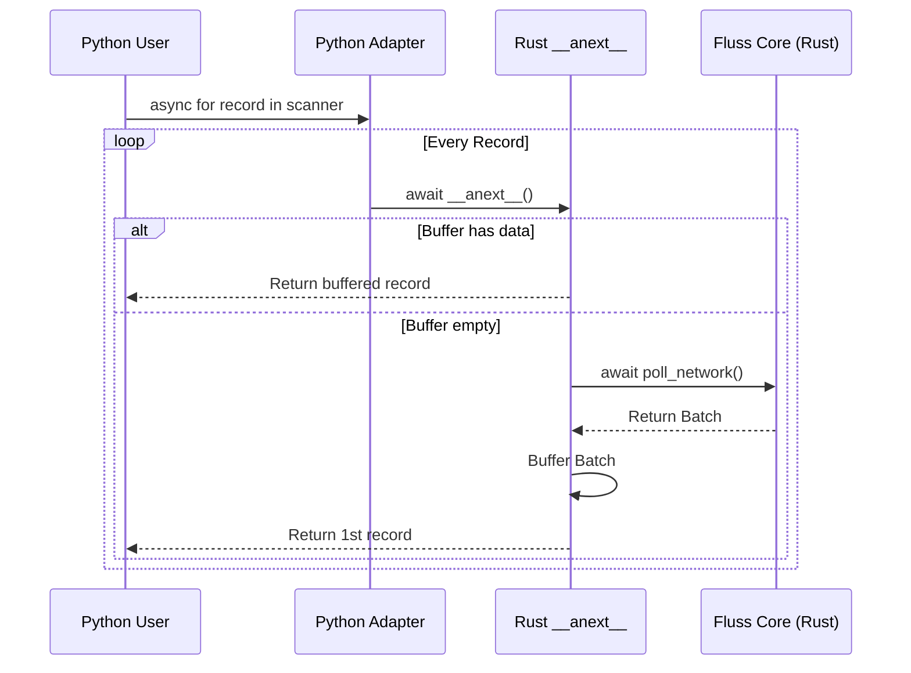

# Architectural Review: Fluss Python Async Iterator Protocol

The implementation of the Asynchronous Iterator Protocol (`__aiter__` and `__anext__`) for the Fluss `LogScanner` represents a critical bridge between Python's single-threaded event loop and Rust's multi-threaded, high-throughput network core.

This document rigorously defends five major design decisions introduced in the diff, explaining the "why" behind the core architectural shifts.

---

## 1. The Concurrency Boundary: `Arc<tokio::sync::Mutex<ScannerState>>`

### The Shift
- **Old Code**: `scanner: ScannerKind` (Direct ownership by `LogScanner`)
- **New Code**: `state: Arc<tokio::sync::Mutex<ScannerState>>`

### Architectural Defense
In Python, an `async for` loop typically operates on a single thread (the GIL). However, providing a native `awaitable` back to Python via `pyo3-asyncio` involves handing a Rust `Future` to the **Tokio runtime**.

1.  **Multi-threaded Work Stealing**: Tokio's executor is multi-threaded. A future might start execution on Thread A, yield (on a network wait), and resume on Thread B. Rust's safety model strictly forbids moving mutable state (like the TCP stream inside the scanner) across threads without explicit synchronization.
2.  **Arc (Atomic Reference Counting)**: Wraps the state to allow safe, shared ownership across the asynchronous `Future` and the main `LogScanner` instance.
3.  **Tokio Mutex vs. Std Mutex**: Unlike `std::sync::Mutex`, which blocks the physical OS thread, `tokio::sync::Mutex` is "async-aware." If the lock is held, the task yields the thread back to the runtime, ensuring the entire application doesn't freeze during high contention.

```mermaid
graph TD
    subgraph Python Runtime
        AL[Async Loop]
    end
    subgraph Tokio Runtime (Thread Pool)
        T1[Thread A]
        T2[Thread B]
    end
    state((Arc&lt;Mutex&lt;ScannerState&gt;&gt;))
    
    AL -- calls --> AN[__anext__]
    AN -- spawns --> F[Future]
    F -- executed on --> T1
    T1 -- locks --> state
    F -- yields --> T1
    F -- resumes on --> T2
    T2 -- locks --> state
```

---

## 2. The Buffering Strategy: `PendingRecords` Deque

### The Shift
Introduction of `pending_records: std::collections::VecDeque<Py<ScanRecord>>` inside `ScannerState`.

### Architectural Defense
The underlying Fluss core library polls data in **batches** for network efficiency. However, the Python `__anext__` protocol requires yielding **one record at a time**.

1.  **Amortized Polling Cost**: Calling the network for every single record in an `async for` loop would be disastrous for performance.
2.  **Impedance Mismatch**: The buffer acts as a pressure valve, converting the "batch-push" nature of the network into the "row-pull" nature of a Python iterator.
3.  **Memory Management**: By using `Py<ScanRecord>`, we store pointers to Python-managed objects that have already been converted, minimizing the conversion overhead during the next `__anext__` call.

---

## 3. The Multi-Runtime Bridge: `future_into_py`

### The Shift
`__anext__` now returns `PyResult<Option<Bound<'py, PyAny>>>` by wrapping a Rust async block in `future_into_py`.

### Architectural Defense
This is the "glue" that allows Python's `asyncio` to wait on a Rust `tokio` task.

- **Non-blocking GIL**: Using `future_into_py` allows the Rust code to drop the GIL immediately while waiting for network I/O.
- **Exception Mapping**: It ensures that if the Rust code yields a `FlussError`, it is correctly translated into a `ValueError` or `RuntimeError` on the Python side, maintaining idiomatic error handling.

---

## 4. The "Wait-for-Data" Polling Logic

### The Shift
```rust
while current_records.is_empty() {
    current_records = scanner.poll(timeout).await?;
}
```

### Architectural Defense
In a streaming context, a network poll might return "Empty" if the producer hasn't sent new data yet, but the stream hasn't *ended*.

1.  **Semantic Correctness**: If `__anext__` simply returned an empty result to Python, it would signal the end of the loop (`StopAsyncIteration`).
2.  **Internal Retries**: The `while` loop ensures the future only completes (and returns to the user) once actual data is available or a terminal error/close occurs.
3.  **Efficiency**: Because this is `await`-ed inside a `tokio` task, this loop does not "spin" or consume CPU; it parked until the runtime wakes it up via a reactor event (network activity).

---

## 5. The Iterator Adapter Layer

### The Shift
Implemention of `__aiter__` as an async generator adapter in Python-string format.

### Architectural Defense
PyO3 0.23 introduced changes in how iterators are bound. Directly returning `self` from `__aiter__` sometimes leads to lifetime issues when the iterator is used across different event loop cycles.

- **Stability**: By using a small Python `async generator` adapter, we ensure the object strictly adheres to the Asynchronous Iterator Protocol expected by `PEP 492`.
- **Interoperability**: This guarantees that the scanner works perfectly with `asyncio.gather`, `uvloop`, and other Python async utilities.


