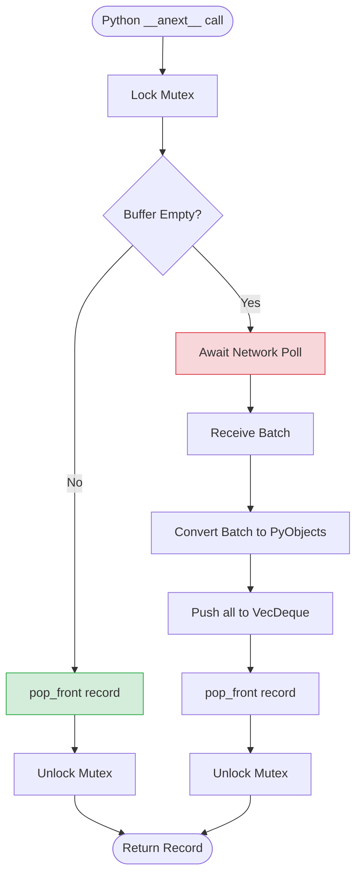

# Architectural Review: The Impedance Buffer (`VecDeque`)

Part 2 of this review focuses on the core data structure that enables high-performance streaming: the `std::collections::VecDeque<Py<ScanRecord>>`.

In distributed systems, an **Impedance Mismatch** occurs when two components operate at different granularities. Here, the Fluss network protocol delivers data in **batches** for efficiency, while the Python `async for` loop consumes data **one record at a time**.

---

## 1. The Design Defense: Why `VecDeque`?

The selection of `std::collections::VecDeque` (a double-ended queue) over a standard `Vec` is a deliberate optimization for the consumer's access pattern.

- **Efficient Front-Popping**: Python's iterator protocol calls `__anext__` repeatedly to get the "next" item. In a standard `Vec`, removing the first element is an $O(n)$ operation because all subsequent elements must be shifted. `VecDeque` provides $O(1)$ `pop_front()`, ensuring that as the buffer grows (e.g., a batch of 10,000 records), the per-record overhead remains constant and negligible.
- **Memory Continuity**: While `VecDeque` is not always a single contiguous block of memory (it is a ring buffer), it provides better cache locality than a linked list while maintaining the performance characteristics needed for a queue.

---

## 2. Fast Path vs. Slow Path Analysis

The `__anext__` implementation is bifurcated into two distinct execution profiles based on the state of the buffer.

### The Fast Path: $O(1)$ CPU, Zero Network
If `pending_records` contains data, the implementation executes the **Fast Path**:
1.  Lock the `ScannerState` Mutex.
2.  `pop_front()` the pre-converted `Py<ScanRecord>`.
3.  Release lock and return to Python.

This path avoids the GIL-releasing async boundary and network stack entirely, allowing the Python loop to iterate through a buffered batch at local memory speeds.

### The Slow Path: Amortized Network Latency
If the buffer is empty, the implementation triggers the **Slow Path**:
1.  **Async Wait**: The task yields to Tokio while waiting for a network poll (`scanner.poll(timeout).await`).
2.  **Batch Conversion**: Once a batch arrives, it is converted into Python objects (`ScanRecord::from_core`).
3.  **Rebuffering**: The entire batch is pushed into the `VecDeque`.
4.  **Yield**: The first record is returned, and the remaining $N-1$ records reside in the buffer for subsequent "Fast Path" calls.

**Defense**: By batching, we amortize the network Round Trip Time (RTT) and the overhead of crossing the Rust-Python boundary over thousands of records.

---

## 3. Pre-converted Records: `Py<ScanRecord>`

The buffer specifically stores `Py<ScanRecord>`, not the raw Rust `core_record`.

1.  **Reducuing GIL Contention**: Converting a record from Rust to Python requires the GIL. By converting the **entire batch at once** when the Slow Path is triggered, we minimize the number of times we must acquire/release the GIL.
2.  **Safety**: `Py<T>` is a "smart pointer" to an object on the Python heap. This ensures that the records are kept alive by the buffer even if the original Rust batch is dropped, preventing use-after-free bugs at the Python-Rust boundary.
3.  **Predictability**: When the user requests the next record, it is already a fully valid Python object, ready for immediate consumption.

---

## 4. Throughput Defense

Without this buffer, the throughput (records/sec) would be limited by:
$$\text{Throughput} \approx \frac{1}{\text{Network RTT}}$$

With the `VecDeque` buffer and batching:
$$\text{Throughput} \approx \frac{\text{Batch Size}}{\text{Network RTT} + \text{Conversion Overhead}}$$

As the `Batch Size` increases, the impact of network latency approaches zero, allowing Fluss to saturate the Python consumer's processing capacity.
