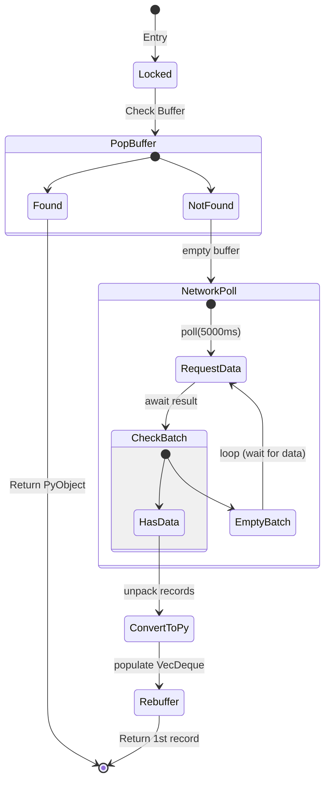

# Architectural Review: The `__anext__` State Machine

Part 3 of this review details the internal state machine governing the `__anext__` method. This method is the engine that drives the Asynchronous Iterator Protocol, transforming a series of network-bound futures into a seamless Python stream.

When a Python user executes `await anext(scanner)`, PyO3 creates a Rust `Future` mapped to a Python `asyncio.Future`. The following state machine executes within that future to resolve the next record.

---

## 1. State Machine Phases

The `__anext__` future moves through four primary phases to ensure thread safety and data integrity.

### Phase 1: Lock Acquisition
```rust
let mut state = state_arc.lock().await;
```
The state machine begins by asynchronously waiting for the `tokio::sync::Mutex`. This phase is critical because, while the Python user is serial, the underlying Tokio runtime is multi-threaded. Locking ensures that even if multiple tasks somehow reference the same scanner state, the internal `VecDeque` and the network socket remain uncorrupted.

### Phase 2: The Fast Path (Buffer Check)
Before touching the network, the machine checks the local buffer:
```rust
if let Some(record) = state.pending_records.pop_front() {
    return Ok(record.into_any());
}
```
If data exists, the future resolves immediately. This is the "high-performance" state that bypasses the complex network logic entirely.

### Phase 3: The Steady-State Polling Loop
If the buffer is empty, the machine enters the **Wait-for-Data** loop. This is the most significant architectural change in the diff.

```rust
while current_records.is_empty() {
    current_records = scanner.poll(timeout).await?;
}
```

---

## 2. Rigorous Defense: Looping vs. Termination

A naive implementation might throw `StopAsyncIteration` (terminating the loop) as soon as a network poll returns zero records (a timeout). However, Fluss implements a **Persistent Stream** pattern.

### Why Loop Exhaustively?
1.  **Semantic Correctness**: In a streaming log system (like Fluss, Kafka, or Pulsar), an empty poll does *not* mean the stream has ended; it simply means the producers haven't sent new data in the last $N$ milliseconds. 
2.  **User Experience**: If Fluss threw `StopAsyncIteration` on a timeout, the Python `async for` loop would exit prematurely. The user would have to manually wrap the loop in a `while True` block, reinventing the polling logic at the application layer.
3.  **Backpressure & Efficiency**: By looping inside the Rust future, we stay "parked" on the Tokio runtime. We consume zero CPU while waiting for the network reactor to wake us up. This keeps the Python event loop free to handle other tasks (UI updates, API requests) while the background stream waits for data.

### Architectural Alignment
This behavior aligns Fluss with industry standards like **Apache Kafka** (where `poll()` blocks until data is available) and **Iceberg** streaming readers. It moves the complexity of "waiting for data" from the user's business logic into the systems-level infrastructure.

---

## 3. The Resolver Diagram

The following diagram traces the state transitions of a single `__anext__` call.



---

## 4. Resource Cleanup & Termination
The ONLY way the state machine exits with a termination signal is if the underlying `ScannerKind` is closed or if an explicit "End of Stream" marker is reached. This is handled by the `Err` cases in the `match state.kind.as_record()` block, which maps terminal scanner states to `PyStopAsyncIteration`, providing a clean, protocol-compliant exit for the Python `async for` loop.
