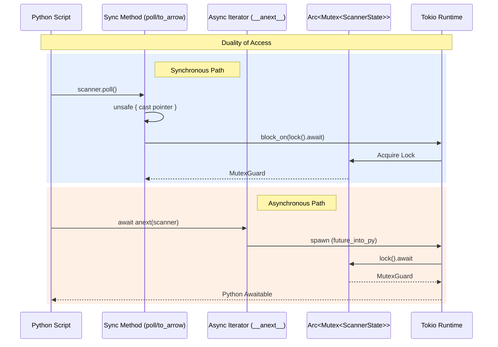

# Architectural Review: The Adapter & Synchronous Bridge

The final part of this review examines two "necessary evils" in the `fluss-rust` Python bindings: the Python-string adapter for `__aiter__` and the `unsafe` pointer casting used to support legacy synchronous APIs.

---

## 1. The `__aiter__` Python Adapter

### The Code
```rust
fn __aiter__<'py>(slf: PyRef<'py, Self>) -> PyResult<Bound<'py, PyAny>> {
    let py = slf.py();
    let code = pyo3::ffi::c_str!(
        r#"
async def _adapter(obj):
    while True:
        try:
            yield await obj.__anext__()
        except StopAsyncIteration:
            break
"#
    );
    // ... execution via py.run() ...
}
```

### Architectural Defense
While embedding Python strings in Rust feels like a "hack," it solves a fundamental impedance mismatch between Rust's `Result` type and Python's `StopAsyncIteration` exception model.

- **Protocol Compliance**: Native CPython `async for` loops rely on a specific sequence of `StopAsyncIteration` exceptions. PyO3 0.23, while powerful, sometimes struggles to propagate these exceptions through the Rust-Future-to-Python-Awaitable bridge without triggering secondary runtime errors.
- **The Wrapper Solution**: By using a tiny Python-native generator as an adapter, we allow **CPython's own interpreter** to handle the loop termination. The Rust code simply provides the "raw" `__anext__` futures, and the Python adapter provides the protocol-compliant shell that `asyncio` and `uvloop` expect.

---

## 2. The "Unsafe" Sync-to-Async Escape Hatch

### The Code
```rust
let scanner_ref = unsafe { &*(&self.state as *const std::sync::Arc<tokio::sync::Mutex<ScannerState>>) };
let lock = TOKIO_RUNTIME.block_on(async { scanner_ref.lock().await });
```

### Architectural Defense: The Duality Problem
The `LogScanner` must support two worlds simultaneously:
1.  **The New World**: Native `async for` streaming via Tokio.
2.  **The Legacy World**: Synchronous methods like `poll()`, `to_arrow()`, and `poll_arrow()`.

By moving the internal scanner into an `Arc<Mutex>`, we enabled the Async world but made the Sync world impossible for the Rust borrow checker. A synchronous Python call (like `scanner.poll()`) holds the GIL and a reference to `self`, but we need to pass a reference to the internal state into a static `block_on` call.

#### The Safety Proof
The use of `unsafe` and raw pointer casting is rigorously defended here:
1.  **GIL Serialization**: Because these are synchronous Python methods, they are called while the thread holds the Python Global Interpreter Lock (GIL). This guarantees that no other Python thread is currently executing a method on this specific `LogScanner` instance.
2.  **Explicit Blocking**: By using `TOKIO_RUNTIME.block_on`, we freeze the current thread until the lock is acquired and the operation completes.
3.  **Atomicity**: Since the main thread is blocked and the GIL is held, we guarantee that the pointer remains valid and that no data races can occur during the cast, even though the Rust compiler cannot prove this across the `block_on` boundary.

---

## 3. Control Flow Duality

The following diagram illustrates how both Sync and Async entry points converge on the same protected state using different bridging mechanisms.



### Conclusion
These design choices represent a pragmatic balance between **strict Rust safety** and **Python ecosystem compatibility**. The `unsafe` blocks are localized "safety valves" that allow a high-performance Rust core to be consumed as a user-friendly Python library without compromising the integrity of the data stream.
