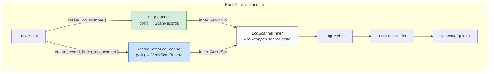
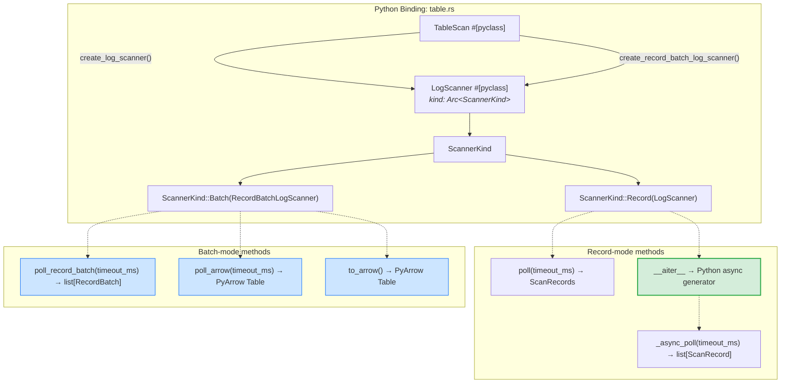
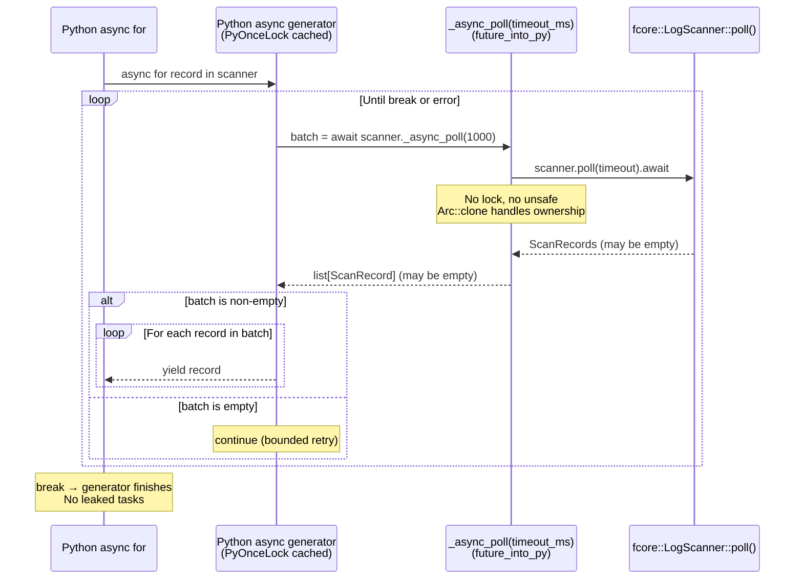
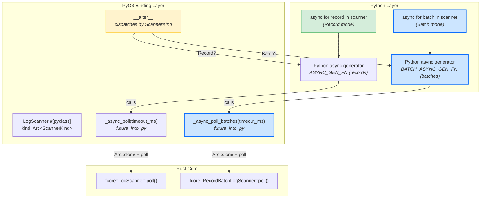
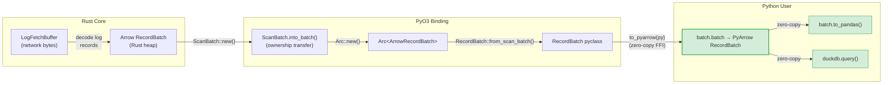
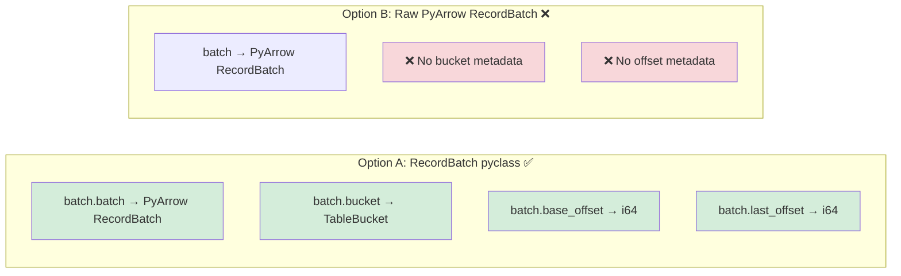
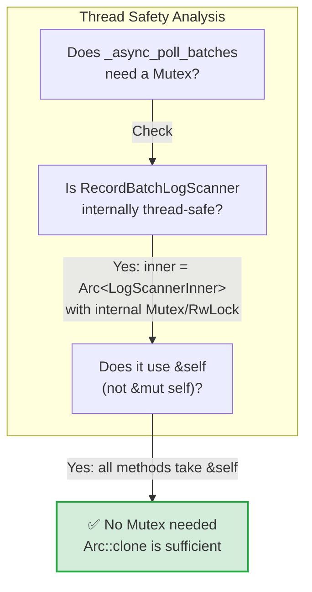

# Issue #424 Extension: Async `RecordBatch` Iterator Proposal

> **Goal**: Extend the existing `__aiter__` protocol to support a `create_record_batch_log_scanner()` path that yields **full PyArrow `RecordBatch`** objects instead of individual `ScanRecord` rows.

---

## Table of Contents

1. [Motivation & Python SDK Target](#1-motivation--python-sdk-target)
2. [Current Architecture Snapshot](#2-current-architecture-snapshot)
3. [Proposed Architecture](#3-proposed-architecture)
4. [Data Flow: End-to-End](#4-data-flow-end-to-end)
5. [Code Change Defense: Exhaustive Breakdown](#5-code-change-defense-exhaustive-breakdown)
6. [Design Decision Matrix](#6-design-decision-matrix)
7. [Alternative Approaches (Rejected)](#7-alternative-approaches-rejected)
8. [Verification Plan](#8-verification-plan)

---

## 1. Motivation & Python SDK Target

### The Gap

The current `__aiter__` implementation (from PR #438) only supports **record-based scanners** (`create_log_scanner()`). If you call `async for` on a batch-based scanner, the `_async_poll` method raises a `TypeError`:

```rust
ScannerKind::Batch(_) => {
    return Err(PyTypeError::new_err(
        "Async iteration is only supported for record scanners; \
         use create_log_scanner() instead.",
    ));
}
```

This means Python users who want **batch-level** Arrow data in an async streaming loop must manually write `while True` polling:

```python
# Current (manual, non-idiomatic) approach for batch scanning
while True:
    batches = scanner.poll_record_batch(1000)
    for batch in batches:
        df = batch.batch.to_pandas()
        process(df)
```

### The Target API

```python
import pyarrow as pa

async def demo_async_batch_loop():
    table = await connection.get_table(table_path)
    
    # Instantiate the batch scanner instead of the standard log scanner
    scanner = await table.new_scan().create_record_batch_log_scanner()
    
    num_buckets = (await admin.get_table_info(table_path)).num_buckets
    scanner.subscribe_buckets({i: fluss.EARLIEST_OFFSET for i in range(num_buckets)})
    
    print("----- Async Batch Reading Start -----")
    
    try:
        # Iterating yields full PyArrow RecordBatches
        async for batch in scanner:
            print(f"Yielded batch with {batch.num_rows} rows.")
            
            # Because it's a native Arrow batch, you get zero-copy downstream integration
            df = batch.to_pandas() 
            # or duckdb.query("SELECT * FROM batch").df()
            
    except Exception as e:
        print(f"Stream complete or error triggered: {e}")

    print("----- Async Batch Reading Finish -----")
```

### Why This Matters

| Concern | Record scanner (`ScanRecord`) | Batch scanner (`RecordBatch`) |
|---------|-------------------------------|-------------------------------|
| **Granularity** | One row per `__anext__` | One Arrow batch per `__anext__` |
| **Metadata** | Per-record offset, timestamp, change_type | Per-batch bucket, base_offset, last_offset |
| **Memory overhead** | N Python dict objects per batch | 1 zero-copy Arrow buffer per batch |
| **Downstream integration** | Manual row-by-row assembly | `batch.to_pandas()`, DuckDB, Polars, etc. |
| **Throughput** | Limited by Python object creation per row | Limited only by network + Arrow deserialization |

For analytical workloads consuming high-volume log streams, the batch scanner can be **10-100x more efficient** because:
1. No per-row Python object creation overhead
2. Arrow's columnar format allows zero-copy integration with Pandas/DuckDB
3. Fewer cross-boundary (Rust ↔ Python) calls per data unit

---

## 2. Current Architecture Snapshot

### 2.1 The Rust Core Layer

Both scanner types share an identical internal engine (`LogScannerInner`) — the only difference is the poll method called:



Key source locations:

| Component | File | Lines |
|-----------|------|-------|
| `TableScan` | [scanner.rs](file:///Users/jaredyu/Desktop/open_source/fluss-rust/crates/fluss/src/client/table/scanner.rs#L54-L250) | 54-250 |
| `LogScanner` | [scanner.rs](file:///Users/jaredyu/Desktop/open_source/fluss-rust/crates/fluss/src/client/table/scanner.rs#L256-L564) | 256-564 |
| `RecordBatchLogScanner` | [scanner.rs](file:///Users/jaredyu/Desktop/open_source/fluss-rust/crates/fluss/src/client/table/scanner.rs#L264-L622) | 264-622 |
| `LogScannerInner` | [scanner.rs](file:///Users/jaredyu/Desktop/open_source/fluss-rust/crates/fluss/src/client/table/scanner.rs#L269-L517) | 269-517 |
| `ScanBatch` | [record/mod.rs](file:///Users/jaredyu/Desktop/open_source/fluss-rust/crates/fluss/src/record/mod.rs#L180-L226) | 180-226 |

Both scanners delegate to the same `LogScannerInner`:
- `LogScanner::poll()` → `inner.poll_records()` → returns `ScanRecords` (per-row hashmap)
- `RecordBatchLogScanner::poll()` → `inner.poll_batches()` → returns `Vec<ScanBatch>` (Arrow batches)

### 2.2 The Python Binding Layer

The Python binding uses a *single* `#[pyclass] LogScanner` that wraps both scanner types via `ScannerKind`:



### 2.3 Current Async Flow (Record Mode Only)

The existing `__aiter__` implementation uses a cached Python async generator that calls `_async_poll`:



The critical gate is in [_async_poll (table.rs:2254-2262)](file:///Users/jaredyu/Desktop/open_source/fluss-rust/bindings/python/src/table.rs#L2254-L2262):

```rust
let core_scanner = match scanner.as_ref() {
    ScannerKind::Record(s) => s,
    ScannerKind::Batch(_) => {
        return Err(PyTypeError::new_err(
            "Async iteration is only supported for record scanners; \
             use create_log_scanner() instead.",
        ));
    }
};
```

**This is the line that blocks batch-mode async iteration.**

---

## 3. Proposed Architecture

### 3.1 High-Level Design

The proposal is to add a parallel `_async_poll_batches` method and a **second** `PyOnceLock`-cached async generator specifically for batch-mode scanners, keeping the existing record-mode path entirely untouched.



### 3.2 Key Structural Changes

| Aspect | Before | After |
|--------|--------|-------|
| `__aiter__` | Always uses record generator | **Dispatches** by `ScannerKind` variant |
| `_async_poll` | Rejects `Batch` with `TypeError` | Unchanged (still record-only) |
| `_async_poll_batches` | Does not exist | **New**: returns `list[RecordBatch]` via `future_into_py` |
| Batch async generator | Does not exist | **New**: `BATCH_ASYNC_GEN_FN: PyOnceLock` |
| Yield type (batch mode) | N/A (blocked) | `RecordBatch` pyclass (already exists) |
| Break behavior | N/A | Same as record: generator exits naturally, no leaked tasks |

### 3.3 Why a Separate Generator (Not a Unified One)

A unified generator that handles both modes would require runtime type-checking per iteration:

```python
# REJECTED: single unified generator
async def _async_scan(scanner, timeout_ms=1000):
    while True:
        result = await scanner._async_poll_unified(timeout_ms)
        if result:
            for item in result:
                yield item
```

This approach is inferior because:

1. **Semantic mismatch**: Record scanners yield `ScanRecord` objects; batch scanners yield `RecordBatch` objects. The user's code after `async for` is fundamentally different for each.
2. **Performance**: Adding a branch at the Python generator level for every iteration step adds unnecessary overhead.
3. **Type clarity**: Two distinct generators make the type contract unambiguous — if you created a batch scanner, you get batches.

---

## 4. Data Flow: End-to-End

### 4.1 Batch Mode Async Flow (New)

```mermaid
sequenceDiagram
    participant Py as Python: async for batch in scanner
    participant Gen as BATCH_ASYNC_GEN_FN<br/>(PyOnceLock cached)
    participant APoll as _async_poll_batches(timeout_ms)<br/>(future_into_py)
    participant Core as fcore::RecordBatchLogScanner::poll()
    participant Net as Network (gRPC)

    Py->>Gen: async for batch in scanner

    loop Until break or error
        Gen->>APoll: batches = await scanner._async_poll_batches(1000)
        APoll->>APoll: Arc::clone(self.kind)
        APoll->>Core: scanner.poll(timeout).await
        Core->>Net: send_fetches() + collect_batches()
        Net-->>Core: Vec&lt;ScanBatch&gt;
        Core-->>APoll: Vec&lt;ScanBatch&gt; (may be empty)

        Note over APoll: Python::attach: convert each<br/>ScanBatch → RecordBatch pyclass<br/>(zero-copy Arrow via to_pyarrow)

        APoll-->>Gen: list[RecordBatch] (may be empty)

        alt batches is non-empty
            loop For each rb in batches
                Gen-->>Py: yield rb
            end
        else batches is empty
            Note over Gen: continue (bounded retry)
        end
    end

    Note over Py: break → generator exits<br/>Arc refcount decrements normally
```

### 4.2 Arrow Zero-Copy Path

The critical performance advantage of the batch path is the **zero-copy** Arrow bridge. Here's the exact data lifecycle:



The `to_pyarrow(py)` call uses Arrow's C Data Interface (FFI) to expose the Rust-owned memory buffer directly to Python without copying. This means the `batch.to_pandas()` call in the user's code operates on the exact same memory that the Rust network layer decoded from the wire.

---

## 5. Code Change Defense: Exhaustive Breakdown

### 5.1 New Method: `_async_poll_batches`

**Location**: [table.rs](file:///Users/jaredyu/Desktop/open_source/fluss-rust/bindings/python/src/table.rs), after `_async_poll` (~line 2282)

```rust
/// Perform a single bounded poll and return a list of RecordBatch objects.
///
/// This is the async building block used by `__aiter__` (batch mode) to
/// implement `async for`. Each call does exactly one network poll (bounded
/// by `timeout_ms`), converts any results to Python RecordBatch objects,
/// and returns them as a list. An empty list signals a timeout (no data
/// yet), not end-of-stream.
///
/// Args:
///     timeout_ms: Timeout in milliseconds for the network poll (default: 1000)
///
/// Returns:
///     Awaitable that resolves to a list of RecordBatch objects
fn _async_poll_batches<'py>(
    &self,
    py: Python<'py>,
    timeout_ms: Option<i64>,
) -> PyResult<Bound<'py, PyAny>> {
    let timeout_ms = timeout_ms.unwrap_or(1000);
    if timeout_ms < 0 {
        return Err(FlussError::new_err(format!(
            "timeout_ms must be non-negative, got: {timeout_ms}"
        )));
    }

    let scanner = Arc::clone(&self.kind);
    let timeout = Duration::from_millis(timeout_ms as u64);

    future_into_py(py, async move {
        let core_scanner = match scanner.as_ref() {
            ScannerKind::Batch(s) => s,
            ScannerKind::Record(_) => {
                return Err(PyTypeError::new_err(
                    "Batch async iteration is only supported for batch scanners; \
                     use create_record_batch_log_scanner() instead.",
                ));
            }
        };

        let scan_batches = core_scanner
            .poll(timeout)
            .await
            .map_err(|e| FlussError::from_core_error(&e))?;

        // Convert to Python list of RecordBatch objects
        Python::attach(|py| {
            let mut result: Vec<Py<RecordBatch>> = Vec::new();
            for scan_batch in scan_batches {
                let rb = RecordBatch::from_scan_batch(scan_batch);
                result.push(Py::new(py, rb)?);
            }
            Ok(result)
        })
    })
}
```

**Defense**:

| Property | Justification |
|----------|--------------|
| **Mirrors `_async_poll` structure** | Same pattern: `Arc::clone`, `future_into_py`, `Python::attach`. Consistency reduces review burden. |
| **Single bounded poll** | Exactly one `core_scanner.poll(timeout)` call per invocation. No infinite loops inside the future → break-safe. |
| **Reuses existing `RecordBatch::from_scan_batch`** | [table.rs:154-161](file:///Users/jaredyu/Desktop/open_source/fluss-rust/bindings/python/src/table.rs#L154-L161) — this conversion already exists and is used by `poll_record_batch()`. Zero new Arrow conversion code needed. |
| **No `unsafe`** | `Arc::clone` provides the `'static` lifetime. `&self` not captured in the future. |
| **Type-correct error** | Raises `TypeError` if called with wrong scanner variant, matching `_async_poll`'s behavior. |

### 5.2 Modified Method: `__aiter__` (Dispatch by ScannerKind)

**Location**: [table.rs:2203-2222](file:///Users/jaredyu/Desktop/open_source/fluss-rust/bindings/python/src/table.rs#L2203-L2222)

```diff
 fn __aiter__<'py>(slf: PyRef<'py, Self>) -> PyResult<Bound<'py, PyAny>> {
-    static ASYNC_GEN_FN: PyOnceLock<Py<PyAny>> = PyOnceLock::new();
     let py = slf.py();
-    let gen_fn = ASYNC_GEN_FN.get_or_init(py, || {
-        let code = pyo3::ffi::c_str!(
-            r#"
-async def _async_scan(scanner, timeout_ms=1000):
-    while True:
-        batch = await scanner._async_poll(timeout_ms)
-        if batch:
-            for record in batch:
-                yield record
-"#
-        );
-        let globals = pyo3::types::PyDict::new(py);
-        py.run(code, Some(&globals), None).unwrap();
-        globals.get_item("_async_scan").unwrap().unwrap().unbind()
-    });
-    gen_fn.bind(py).call1((slf.into_bound_py_any(py)?,))
+
+    match slf.kind.as_ref() {
+        ScannerKind::Record(_) => {
+            static RECORD_ASYNC_GEN_FN: PyOnceLock<Py<PyAny>> = PyOnceLock::new();
+            let gen_fn = RECORD_ASYNC_GEN_FN.get_or_init(py, || {
+                let code = pyo3::ffi::c_str!(
+                    r#"
+async def _async_scan(scanner, timeout_ms=1000):
+    while True:
+        batch = await scanner._async_poll(timeout_ms)
+        if batch:
+            for record in batch:
+                yield record
+"#
+                );
+                let globals = pyo3::types::PyDict::new(py);
+                py.run(code, Some(&globals), None).unwrap();
+                globals.get_item("_async_scan").unwrap().unwrap().unbind()
+            });
+            gen_fn.bind(py).call1((slf.into_bound_py_any(py)?,))
+        }
+        ScannerKind::Batch(_) => {
+            static BATCH_ASYNC_GEN_FN: PyOnceLock<Py<PyAny>> = PyOnceLock::new();
+            let gen_fn = BATCH_ASYNC_GEN_FN.get_or_init(py, || {
+                let code = pyo3::ffi::c_str!(
+                    r#"
+async def _async_batch_scan(scanner, timeout_ms=1000):
+    while True:
+        batches = await scanner._async_poll_batches(timeout_ms)
+        if batches:
+            for rb in batches:
+                yield rb
+"#
+                );
+                let globals = pyo3::types::PyDict::new(py);
+                py.run(code, Some(&globals), None).unwrap();
+                globals
+                    .get_item("_async_batch_scan")
+                    .unwrap()
+                    .unwrap()
+                    .unbind()
+            });
+            gen_fn.bind(py).call1((slf.into_bound_py_any(py)?,))
+        }
+    }
 }
```

**Defense**:

1. **Why dispatch in `__aiter__` (not in the generator)?**

   The generator function text is compiled once and cached in `PyOnceLock`. If we used a single generator that accepted both types, it would need runtime dispatch on every iteration:

   ```python
   # BAD: runtime dispatch overhead per-iteration
   async def _unified(scanner, timeout_ms=1000):
       poll_fn = scanner._async_poll_batches if scanner._is_batch else scanner._async_poll
       while True:
           result = await poll_fn(timeout_ms)
           ...
   ```

   By dispatching in `__aiter__` (called once per `async for`), the generator's hot loop is branchless.

2. **Why two `PyOnceLock` statics (not one)?**

   Each `PyOnceLock` caches a different compiled function. Using two statics keeps them independent — neither can overwrite the other, and each is initialized lazily on first use.

3. **Backwards compatibility**: The `ScannerKind::Record` branch is **byte-for-byte identical** to the current implementation. Existing record-mode `async for` behavior is completely preserved.

4. **Break safety**: The batch generator follows the same pattern: `_async_poll_batches` does a single bounded poll → returns a list → generator yields items from the list → on `break`, Python GC cleans up the generator → no leaked tasks.

### 5.3 What We Do NOT Change

| Component | Reason |
|-----------|--------|
| `_async_poll` | Record-mode path is unaffected. |
| `poll()` | Synchronous record polling is orthogonal. |
| `poll_record_batch()` | Synchronous batch polling remains available. |
| `poll_arrow()` | Synchronous PyArrow table remains available. |
| `to_arrow()` / `to_pandas()` | Batch-to-completion methods are orthogonal. |
| `subscribe_*` / `unsubscribe_*` | Subscription layer is shared and unchanged. |
| `ScannerKind` enum | No structural changes — we only read it, not modify it. |
| Core Rust layer | No changes to `scanner.rs`, `LogScannerInner`, `LogFetcher`, etc. |
| `RecordBatch` pyclass | Already exists and has all needed methods. |

---

## 6. Design Decision Matrix

### 6.1 What Does `async for batch in scanner` Yield?

**Decision: Yield `RecordBatch` pyclass objects (not raw `PyArrow RecordBatch`)**



**Justification**:
- Users need `bucket` and `offset` metadata to track consumption progress, implement checkpointing, or filter by partition.
- The `RecordBatch` pyclass [already exists](file:///Users/jaredyu/Desktop/open_source/fluss-rust/bindings/python/src/table.rs#L112-L162) and exposes `.batch`, `.bucket`, `.base_offset`, `.last_offset`.
- The raw Arrow batch is trivially accessible via `batch.batch`.

> [!NOTE]
> For users who want the sugar of `batch.num_rows` or `batch.to_pandas()` directly, we could consider adding `__getattr__` delegation to the inner PyArrow batch in a follow-up PR. This proposal intentionally keeps the scope small.

### 6.2 What Happens with Empty Polls?

**Decision: Same as record mode — generator loops and retries.**

```python
# The cached generator for batch mode:
async def _async_batch_scan(scanner, timeout_ms=1000):
    while True:
        batches = await scanner._async_poll_batches(timeout_ms)
        if batches:       # Only yield when we have data
            for rb in batches:
                yield rb
        # Empty list → loop again (NOT StopAsyncIteration)
```

This matches the streaming log semantics established in [fluss_diff_pt3.md](file:///Users/jaredyu/Desktop/open_source/fluss-notes/fluss_diff_pt3.md): an empty poll means "no data yet," not "stream ended."

### 6.3 Concurrency Model



As established in [pr_review_pt1.md §3.1](file:///Users/jaredyu/Desktop/open_source/fluss-notes/pr_review_pt1.md), both `LogScanner` and `RecordBatchLogScanner` achieve internal thread safety through:
- `LogFetchBuffer`: internal `Mutex` + `Condvar`
- `LogScannerStatus`: internal `parking_lot::Mutex`
- `Metadata`: internal `RwLock`

Therefore `_async_poll_batches` uses the same `Arc::clone` pattern as `_async_poll` — no external Mutex, no `unsafe`.

---

## 7. Alternative Approaches (Rejected)

### 7.1 Separate `RecordBatchLogScanner` Python Class

**Idea**: Create a separate `#[pyclass] RecordBatchLogScanner` instead of reusing `LogScanner`.

**Rejected because**:
- The current design deliberately unifies both scanner types under one `LogScanner` pyclass with `ScannerKind` dispatch. This was a deliberate architectural choice (see [table.rs:1898-1914](file:///Users/jaredyu/Desktop/open_source/fluss-rust/bindings/python/src/table.rs#L1898-L1914)).
- Duplicating the class would duplicate `subscribe_*`, `unsubscribe_*`, `__repr__`, and all shared methods.
- The Python user already creates the right variant via `create_log_scanner()` vs `create_record_batch_log_scanner()`.

### 7.2 Single Generator with Dynamic Dispatch

**Idea**: Use one generator that dynamically checks the scanner type per iteration.

**Rejected because** (see §5.2 defense point 1):
- Per-iteration Python branch adds overhead to the hot loop.
- The generator text is compiled once via `PyOnceLock` — if both modes shared one generator, you'd need a runtime flag or attribute access to distinguish them.

### 7.3 Convert Batches to Raw PyArrow RecordBatch Inside the Generator

**Idea**: Have `_async_poll_batches` return raw `PyArrow RecordBatch` objects instead of the `RecordBatch` pyclass.

**Rejected because**:
- Loses bucket and offset metadata (see §6.1).
- Inconsistent with `poll_record_batch()` which already returns `RecordBatch` pyclass objects.
- Users can always access the raw Arrow batch via `.batch` property.

### 7.4 Wrap with `__anext__` Instead of Python Generator

**Idea**: Implement `__anext__` directly in Rust (yielding `RecordBatch` objects).

**Rejected because**:
- The PR #438 review (see [pr_review_pt1.md §5.4](file:///Users/jaredyu/Desktop/open_source/fluss-notes/pr_review_pt1.md)) already established that a Python async generator is superior to a Rust `__anext__` for:
  - CPython async protocol compliance
  - Break safety (no leaked tokio tasks)
  - `PyOnceLock` caching (compile once)

---

## 8. Verification Plan

### 8.1 Automated Tests

```bash
# Existing tests must still pass (no regression)
cd bindings/python
pytest test/test_log_table.py -v

# Cargo tests
cargo test --all
```

### 8.2 New Tests to Add

| Test | What It Verifies |
|------|-----------------|
| `test_batch_async_iterator` | `async for rb in batch_scanner` yields `RecordBatch` objects with correct `.batch`, `.bucket`, `.base_offset`, `.last_offset` |
| `test_batch_async_iterator_break` | Breaking out of `async for` with a batch scanner does not leak resources |
| `test_record_async_iterator_unchanged` | Existing record-mode `async for` behavior is identical |
| `test_async_poll_batches_wrong_scanner` | Calling `_async_poll_batches` on a record scanner raises `TypeError` |
| `test_async_poll_batches_empty` | `_async_poll_batches` returns empty list on timeout, not `StopAsyncIteration` |
| `test_batch_async_to_pandas` | Verifying the end-to-end flow: `async for rb in scanner → rb.batch.to_pandas()` produces valid DataFrame |

### 8.3 Integration Test Example

```python
import asyncio
import fluss

async def test_batch_async_integration():
    config = fluss.Configuration()
    config.set_string("bootstrap.servers", "localhost:9123")
    conn = await fluss.FlussConnection.create(config)
    admin = conn.admin()
    
    table_path = fluss.TablePath("fluss", "test_batch_async")
    table = await conn.get_table(table_path)
    
    # Create batch scanner
    scanner = await table.new_scan().create_record_batch_log_scanner()
    
    info = await admin.get_table_info(table_path)
    scanner.subscribe_buckets({
        i: fluss.EARLIEST_OFFSET for i in range(info.num_buckets)
    })
    
    batches_received = 0
    total_rows = 0
    
    async for rb in scanner:
        # rb is a RecordBatch pyclass
        assert hasattr(rb, 'batch')        # PyArrow RecordBatch
        assert hasattr(rb, 'bucket')       # TableBucket
        assert hasattr(rb, 'base_offset')  # i64
        assert hasattr(rb, 'last_offset')  # i64
        
        arrow_batch = rb.batch
        assert arrow_batch.num_rows > 0
        
        df = arrow_batch.to_pandas()
        total_rows += len(df)
        batches_received += 1
        
        if batches_received >= 5:
            break  # Test break safety
    
    print(f"Received {batches_received} batches, {total_rows} total rows")
    assert batches_received == 5
    assert total_rows > 0
```

### 8.4 Manual Verification

- Confirm `cargo clippy` produces no new warnings
- Confirm `cargo fmt --all --check` passes
- Confirm `ruff check` passes on Python test files
- Verify that the `RecordBatch.__str__` output is informative in the async iterator context

---

> [!IMPORTANT]
> **Summary of changes required**:
> 1. Add `_async_poll_batches(timeout_ms)` method to `LogScanner` pyclass (~35 lines)
> 2. Modify `__aiter__` to dispatch by `ScannerKind` variant (~25 additional lines)
> 3. Add `BATCH_ASYNC_GEN_FN: PyOnceLock` static for the batch generator
> 4. Add tests for batch async iteration, break safety, and type errors
>
> **Total estimated diff**: ~80 lines of Rust, ~60 lines of Python tests
>
> **Files modified**: 1 (`bindings/python/src/table.rs`)
>
> **Files added**: 1 (test file for batch async iteration)
>
> **Core Rust layer**: No changes
