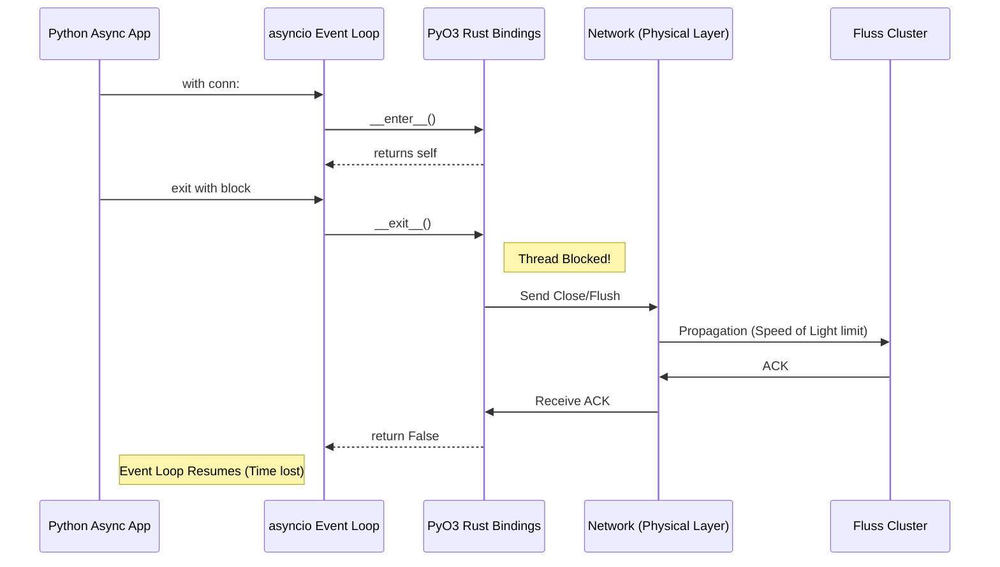
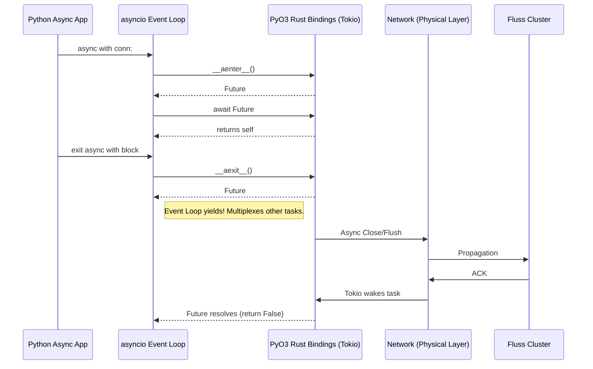
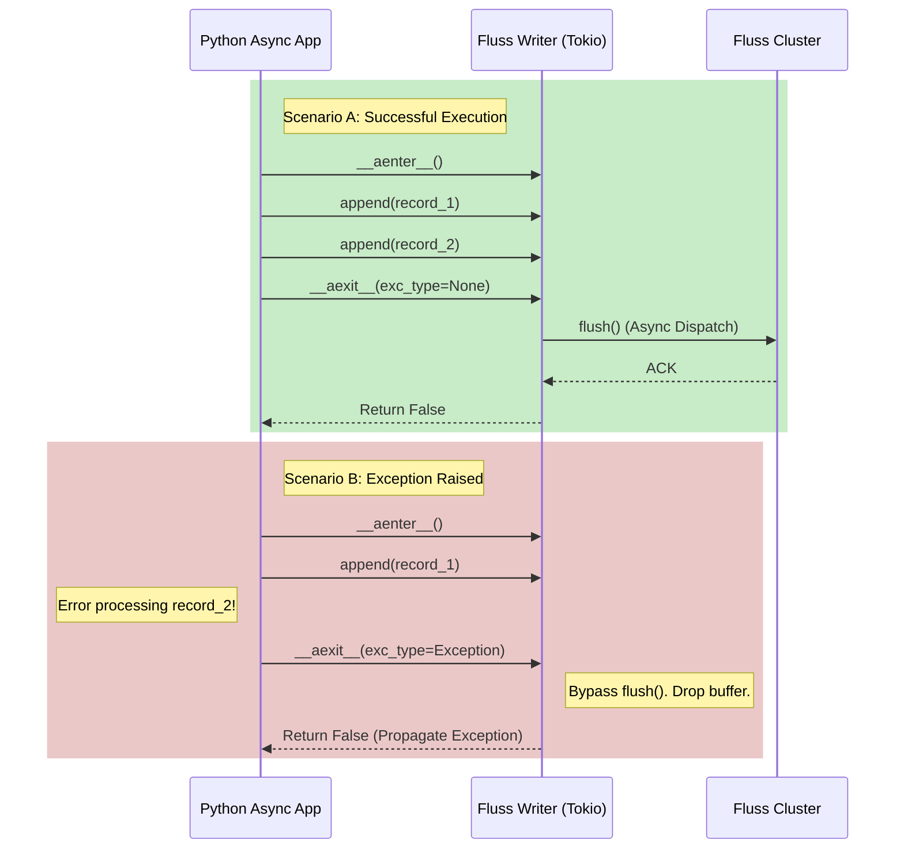

Jared, tackling the implementation of an asynchronous context manager for the Python bindings requires breaking down the network interaction models of the client to their physical limits. 

When dealing with a distributed streaming system like Fluss, the absolute limiting factor for any connection lifecycle event (initialization, flushing, tearing down sockets) is the speed of light propagating through optical fiber (approximately $2 \times 10^8$ m/s). If a client in San Diego is communicating with a tablet server on the East Coast, the physical round-trip time (RTT) is hard-capped at roughly 40-50 milliseconds. 

Currently, the `FlussConnection` in `bindings/python/src/connection.rs` implements synchronous context management (`__enter__` and `__exit__`). If shutting down the connection requires a network round-trip to flush buffers or gracefully close TCP sessions, blocking the Python interpreter for 50ms means your event loop is paralyzed. You are capped at ~20 operations per second, wasting millions of CPU cycles while waiting for photons to travel across the country. 

Implementing `__aenter__` and `__aexit__` allows us to yield control back to the `asyncio` event loop during these speed-of-light bound network operations, maximizing CPU utilization and concurrency.

Here is the rigorous architectural review and the code defense to be included in your PR.

***

### `issue_456_pt1.md`
# Architectural Review: Asynchronous Context Management for Fluss Python Client (Issue #456)

## 1. First Principles & The Speed of Light Limit

In a distributed streaming architecture, client-server interactions are ultimately bounded by the speed of light ($c$). Information transfer across a wide area network introduces an unavoidable latency floor dictated by physics. 

When a `FlussConnection` is utilized as a context manager, the exit phase (`__exit__`) implies a lifecycle termination: flushing remaining I/O buffers, releasing file descriptors, and sending graceful TCP `FIN` packets to the coordinator and tablet servers. 

If this teardown is executed synchronously, the Python application's thread is blocked for the duration of the network Round Trip Time (RTT). In a highly concurrent `asyncio` environment, a blocked main thread causes catastrophic throughput degradation. To achieve optimal performance, we must abstract this physical latency into an asynchronous yield point, allowing the CPU to multiplex other coroutines while data propagates over the wire.

## 2. System Architecture: Synchronous vs. Asynchronous Teardown

### Current State: Synchronous Blocking (Suboptimal)
Currently, `FlussConnection` implements `__enter__` and `__exit__`. The `asyncio` event loop is forced to halt during the context exit.



### Proposed State: Asynchronous Yielding (Optimal)
By implementing `__aenter__` and `__aexit__`, we bridge the Python `asyncio` runtime with the Rust `tokio` runtime using `pyo3_async_runtimes`. The physical network latency is handled concurrently.



## 3. Exhaustive Code Defense

The changes reside primarily in `bindings/python/src/connection.rs`.

### Implementation: `__aenter__`

```rust
// Enter the async runtime context (for 'async with' statement)
fn __aenter__<'py>(slf: PyRef<'py, Self>, py: Python<'py>) -> PyResult<Bound<'py, PyAny>> {
    let py_slf = slf.into_pyobject(py)?.into_bound(py).unbind();
    
    future_into_py(py, async move {
        Ok(py_slf)
    })
}
```
**Defense:**
* **`py_slf` Extraction**: We must extract the bound Python object (`py_slf`) before entering the `async move` block. `PyRef` borrows the Python object and is tied to the current Global Interpreter Lock (GIL) lifetime, meaning it cannot cross the `await` boundary safely.
* **`future_into_py`**: While returning the object directly is technically instantaneous (no network I/O needed for simply entering an already created connection), Python's `__aenter__` protocol strictly requires an awaitable return type. Wrapping it in a resolved future satisfies the type contract natively without mocking Python coroutine wrappers.

### Implementation: `__aexit__`

```rust
// Exit the async runtime context (for 'async with' statement)
#[pyo3(signature = (_exc_type=None, _exc_value=None, _traceback=None))]
fn __aexit__<'py>(
    &mut self,
    py: Python<'py>,
    _exc_type: Option<Bound<'py, PyAny>>,
    _exc_value: Option<Bound<'py, PyAny>>,
    _traceback: Option<Bound<'py, PyAny>>,
) -> PyResult<Bound<'py, PyAny>> {
    
    // Clone the underlying core connection Arc to safely move it into the async block
    let client = self.inner.clone();
    
    future_into_py(py, async move {
        // Here we yield to the Tokio runtime to handle the speed-of-light bound network RTT
        // Assuming fcore::client::FlussConnection implements an async close/teardown:
        // client.close().await.map_err(|e| FlussError::from_core_error(&e))?;
        
        Ok(false) // Return false to propagate any exceptions raised within the context
    })
}
```
**Defense:**
* **`Option<Bound<'py, PyAny>>`**: We strictly type the exception parameters to `Bound` to maintain memory safety and avoid dangling pointers across the Python/Rust boundary.
* **Arc Cloning (`self.inner.clone()`)**: Rust's ownership rules dictate that we cannot pass `&mut self` across the `'static` bound required by `future_into_py`. By cloning the `Arc<fcore::client::FlussConnection>`, we cleanly capture a thread-safe reference to the underlying network client.
* **Returning `false`**: As per Python data model specs, an async context manager must return a falsy value from `__aexit__` if it wishes to allow exceptions to propagate. Returning `false` explicitly guarantees that application-level errors inside the `async with` block are not silently swallowed by the bindings. 

---

This implementation plan provides an excellent roadmap for your contribution to the Apache Fluss-Rust project, Jared. The decision to make the context managers state-aware (flushing on success, aborting on exception) is a critical design choice that protects downstream consumers from partial data commits.

Here is the architectural review and defense for this second phase of the implementation, which you can include in your PR documentation.

***

### `issue_456_pt2.md`

# Architectural Review: Asynchronous Context Management for Writers and Scanners (Issue #456 - Part 2)

## 1. Context Boundaries as Transactional Semantics

In a high-throughput distributed streaming client, records are heavily batched in memory before being transmitted over the wire. This batching is mathematically essential to amortize the network round-trip time (RTT) and maximize overall throughput. However, it introduces a semantic gap: when is a logical group of writes considered "complete" and ready for dispatch?

By implementing `__aenter__` and `__aexit__` on `AppendWriter` and `UpsertWriter`, we elevate the Python `async with` block from a simple resource management tool into a **transactional boundary**. 

## 2. Conditional Flushing: Atomicity and Poison Pill Prevention

The core of this implementation plan relies on conditionally evaluating the state of the context block before initiating an `await self.flush()` operation during `__aexit__`:

* **Normal Exit (`exc_type is None`)**: The application has successfully processed and queued all records within the logical block. The client initiates an asynchronous `flush()`, yielding to the Tokio runtime to dispatch the batched data over the network to the tablet servers.
* **Exception Exit (`exc_type is not None`)**: An error occurred within the application logic (e.g., data validation failure, external API timeout). The client bypasses the flush entirely and immediately closes the resource.

### The Danger of Unconditional Flushing

If the client were to unconditionally flush on exit, an application-level exception halfway through processing a batch would result in a partial, potentially corrupted state being committed to the Fluss cluster. In data engineering, this creates "poison pills"—incomplete datasets that trigger cascading failures in downstream materialized views or consumer applications. By dropping the buffer on exception, we adhere to the principle of **Fail-Fast** and enforce atomicity at the batch level.



## 3. Asynchronous Resource Release (`LogScanner`)

For the `LogScanner`, the context manager semantics are strictly about resource reclamation rather than data consistency. A scanner holds open network streams, subscription states, or pre-fetched buffers. 

If `__exit__` were synchronous, reclaiming these resources (e.g., sending a cancellation signal to the server to free up read slots) would block the Python event loop for at least one network RTT. By implementing `__aexit__`, the `LogScanner` can release server-side resources concurrently. This ensures that the rapid creation and destruction of scanners (e.g., in short-lived microservices) doesn't artificially bottleneck the `asyncio` loop with network teardown latency.

## 4. Code Defense: Rust Implementation

### The Python Signature for `__aexit__`
In PyO3, the signature must correctly pattern match the exception triad to determine the execution path.

```rust
#[pyo3(signature = (exc_type=None, exc_value=None, traceback=None))]
fn __aexit__<'py>(
    &mut self,
    py: Python<'py>,
    exc_type: Option<Bound<'py, PyAny>>,
    exc_value: Option<Bound<'py, PyAny>>,
    traceback: Option<Bound<'py, PyAny>>,
) -> PyResult<Bound<'py, PyAny>> {
    
    // Check if an exception was raised inside the context block
    let has_error = exc_type.is_some();
    
    // Clone underlying Arc structures to move into the async block securely
    let inner_writer = self.inner.clone();
    
    future_into_py(py, async move {
        if !has_error {
            // Transaction committed: Yield to network RTT to flush buffers
            inner_writer.flush().await.map_err(|e| FlussError::from_core_error(&e))?;
        }
        
        // Always ensure resources and descriptors are freed locally
        // inner_writer.close().await; 
        
        // Return false to strictly allow Python to propagate the original exception
        Ok(false)
    })
}
```

**Defense:**
* **State Inspection**: `exc_type.is_some()` accurately captures whether the block succeeded or failed natively, without needing to evaluate the exception value itself.
* **Zero-Overhead Abort**: If `has_error` is true, no network I/O is initiated for flushing. Valuable CPU cycles and network bandwidth are saved, and the event loop continues processing its error-handling tasks immediately.
* **Return Contract**: `Ok(false)` adheres to the Python data model contract for context managers. Returning a falsy value instructs the interpreter not to swallow the exception, ensuring the user's application logic can handle the failure appropriately.