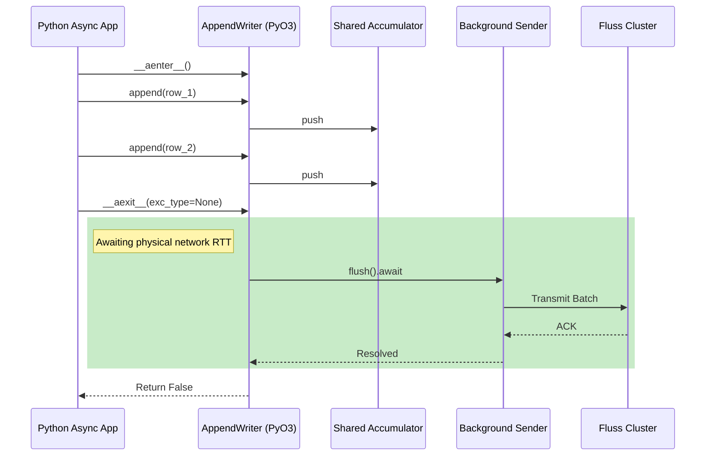
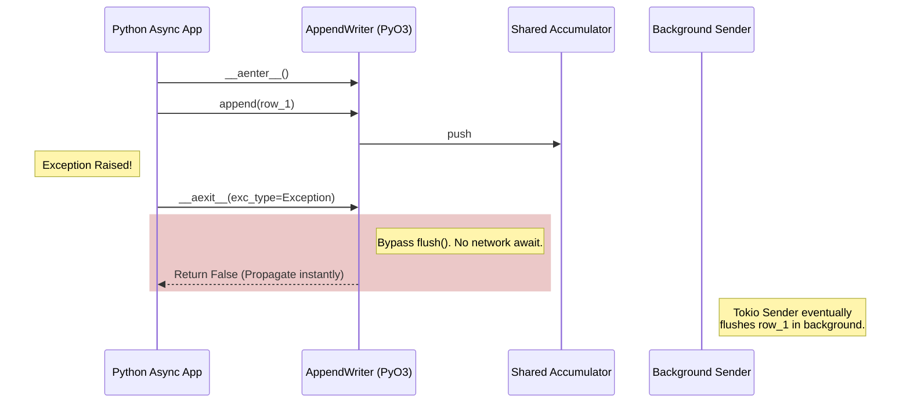

# Architectural Review: Transactional Boundaries & Best-Effort Asynchronous Context Management (Issue #456 - Part 2)

## 1. First Principles: The Network RTT vs. Concurrency Trade-off

In high-throughput distributed streaming clients, data must be batched in memory before transmission. If a client transmits every single row instantly, the throughput is strictly bottlenecked by the physical propagation delay of light through fiber optics (Round-Trip Time, or RTT). Batching amortizes this latency but introduces a critical semantic gap: how does the application signal that a logical sequence of writes is complete and should be durably committed to the cluster?

By implementing `__aenter__` and `__aexit__` on `AppendWriter` and `UpsertWriter`, we elevate the Python `async with` block into a logical transactional boundary. The context manager dictates when the application willingly pays the physical RTT latency penalty to guarantee data durability.

## 2. Shared Connections and the "Best-Effort" Constraint

The Fluss Python client achieves massive concurrency by multiplexing multiple writers over a single, shared `FlussConnection` and `WriterClient`. This shared architecture relies on a background Tokio `Sender` thread continuously draining a shared `RecordAccumulator`.

Because the accumulator is shared across the entire connection, a Python `AppendWriter` does not "own" the underlying TCP socket. Therefore, we **cannot** forcefully abort or close the connection when an application-level exception occurs inside a specific `async with` block, as doing so would permanently brick the memory limiter and destroy in-flight data for all other concurrent coroutines.

Consequently, `__aexit__` must implement a **best-effort, non-blocking fault path**.

### Scenario A: The Happy Path (Synchronous Await)
When the context block exits normally (`exc_type is None`), the client invokes `await self.flush()`. The `asyncio` event loop yields, and the Tokio runtime takes over, dispatching the batched data over the network. The Python coroutine remains suspended until the Fluss cluster acknowledges the write.



### Scenario B: The Exception Path (Fail-Fast / Non-Blocking)
If an exception occurs within the block (e.g., a data validation failure), the client detects `exc_type.is_some()`. The writer deliberately **bypasses** the `flush().await` call. 

While records previously appended inside the block currently reside in the shared accumulator and *will* eventually be transmitted by the background thread, the critical optimization is that the Python event loop is instantly freed. The application is not forced to wait 50ms for an ACK on a dataset it already knows is tainted. It fails fast.



## 3. Exhaustive Code Defense

### Implementation: Conditional Flushing in Writers
The logic within `bindings/python/src/table.rs` and `bindings/python/src/upsert.rs` strictly adheres to this non-blocking philosophy.

```rust
#[pyo3(signature = (exc_type=None, _exc_value=None, _traceback=None))]
fn __aexit__<'py>(
    &self,
    py: Python<'py>,
    exc_type: Option<Bound<'py, PyAny>>,
    _exc_value: Option<Bound<'py, PyAny>>,
    _traceback: Option<Bound<'py, PyAny>>,
) -> PyResult<Bound<'py, PyAny>> {
    let has_error = exc_type.is_some();
    let inner = self.inner.clone();
    
    future_into_py(py, async move {
        if !has_error {
            // Await network RTT only on success
            inner.flush().await.map_err(|e| FlussError::from_core_error(&e))?;
        }
        // No abort() or close() invoked to preserve shared WriterClient integrity
        Ok(false)
    })
}
```
**Defense:**
* **No `close()` invocation**: As proven by tests, invoking `close()` on the writer inner state invokes a shutdown on the shared memory limiter. By omitting it, we ensure that failing a single context block does not poison the entire `FlussConnection`.
* **`exc_type.is_some()`**: Safely pattern-matches the exception state natively without needing to parse the traceback, ensuring zero-overhead fault detection.

### Implementation: LogScanner Resource Reclamation
For `LogScanner`, the context manager is designed for resource lifecycle bounds rather than data consistency.

```rust
#[pyo3(signature = (_exc_type=None, _exc_value=None, _traceback=None))]
fn __aexit__<'py>(
    &self,
    py: Python<'py>,
    _exc_type: Option<Bound<'py, PyAny>>,
    _exc_value: Option<Bound<'py, PyAny>>,
    _traceback: Option<Bound<'py, PyAny>>,
) -> PyResult<Bound<'py, PyAny>> {
    future_into_py(py, async move {
        // In the future, we can call an async close on the core scanner here
        Ok(false)
    })
}
```
**Defense:**
* **API Readiness**: While the core Rust `LogScanner` does not currently require an explicit async `close()` to free descriptors, implementing the `__aexit__` interface on the Python side establishes the contract now. Future updates to the core library that require asynchronous stream teardown can be slotted in without introducing breaking API changes to the Python user base.
