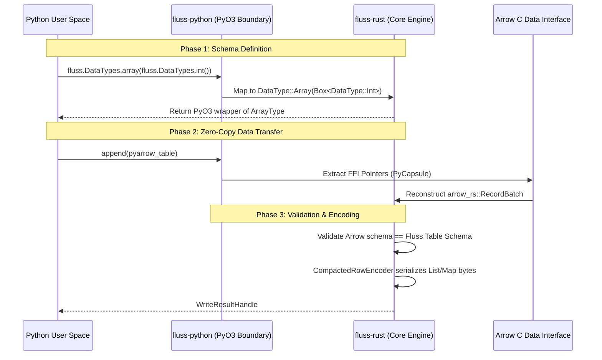
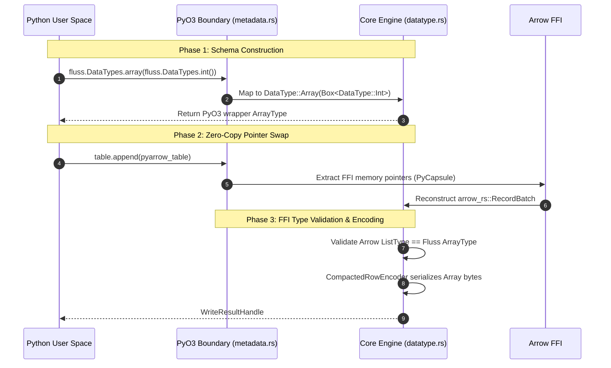

# Issue 469 Implementation Plan: Python Bindings for Complex Types

## 1. First Principles & The "Speed of Light" Limit
In modern distributed data processing, the fundamental bottleneck is rarely CPU compute cycles; it is **memory bandwidth and serialization overhead**. When moving data from a high-level language runtime (Python) into a high-performance systems language (Rust) and ultimately over the network, the "speed of light" limit is defined by how closely we can achieve a **zero-copy architecture**.

Every time a memory buffer is parsed, copied, or re-allocated across the Foreign Function Interface (FFI) boundary, throughput drops. Apache Fluss solves this by standardizing on **Apache Arrow** as the in-memory columnar format and a highly optimized **Compacted Row** format for network/disk I/O. 

When exposing complex, nested data types (Arrays, Maps, Rows) to Python, the architectural mandate is strict:
1. **Metadata Definition:** The schema must be defined in Python but backed by the strict Rust Abstract Syntax Tree (AST) to prevent invalid memory layouts.
2. **Data Execution:** Payload transfer between PyArrow (Python) and `arrow-rs` (Rust) must be limited to C-pointer swaps (via the Arrow C Data Interface). No Python iteration over arrays or dictionaries is permitted.

## 2. Historical Context: The Path to #469

The implementation of complex types in `fluss-rust` follows a strict bottom-up dependency graph.

* **Issue #386 & PR #433 (The Core Engine Foundation):** Before any bindings could be written, the core Rust engine needed the physical capability to understand collections. PR #433 introduced the `DataType::Array` AST node, the `arrow::datatypes::DataType::List` mapping, and, crucially, the byte-level recursive binary encoding logic in `compacted_row_encoder.rs`. This established the blueprint for how memory offsets are tracked for variable-length nested data. Similar issues (#387, #388) followed to implement `Map` and `Row` types in the core.
* **Issue #468 (The C++ FFI Boundary):** With the core engine capable of processing complex types, #468 tracked the exposure of these types across the raw C ABI so that C++ applications could define schemas containing arrays, maps, and rows.
* **Issue #469 (The Python PyO3 Boundary):** This is the final terminal node in the complex-type epic. It requires bridging the core Rust capabilities established in #433 into the Python interpreter space. Since the Python data engineering ecosystem heavily relies on PyArrow, #469 must connect Python schema definitions (`fluss.DataTypes.array(...)`) to the Rust core, and validate PyArrow batches against these nested structures before writing.

## 3. Architectural Review

Below is the system architecture for how complex types must cross the Python/Rust boundary.



## 4. The Expected Implementation Plan for #469

The codebase already contains the core Rust AST for these types. The scope of #469 is strictly confined to `bindings/python/`.

### Part A: AST and Type Exposure (`bindings/python/src/metadata.rs`)
**Requirement:** Python users must be able to construct valid complex schemas.
**Implementation Defense:** We cannot pass raw Rust enums (like `DataType::Array`) directly to Python because PyO3 requires types to implement `#[pyclass]` for memory lifecycle management by the Python Garbage Collector. 

1.  **Define PyO3 Wrapper Classes:** Create rigid wrappers around the existing Rust structs.
    ```rust
    // In bindings/python/src/metadata.rs
    #[pyclass]
    #[derive(Clone)]
    pub struct ArrayType {
        pub(crate) inner: fcore::metadata::datatype::ArrayType,
    }

    #[pyclass]
    #[derive(Clone)]
    pub struct MapType {
        pub(crate) inner: fcore::metadata::datatype::MapType,
    }
    // ... similarly for RowType
    ```
2.  **Expose Builder Methods:** Update the `DataTypes` python class to support recursive type building.
    ```rust
    #[pymethods]
    impl DataTypes {
        #[staticmethod]
        fn array(element_type: &Bound<'_, PyAny>) -> PyResult<ArrayType> {
            // Defense: We must dynamically extract the underlying Rust DataType 
            // from the PyAny object to support arbitrary nesting (e.g., ARRAY<ARRAY<INT>>).
            let inner_type = extract_datatype(element_type)?; 
            Ok(ArrayType {
                inner: fcore::metadata::datatype::ArrayType::new(inner_type),
            })
        }
    }
    ```

### Part B: Module Registration (`bindings/python/src/lib.rs`)
**Requirement:** The Python runtime must recognize the new types.
**Implementation Defense:** PyO3 module initialization builds the C-extension dictionary. Failure to register here results in `ImportError` in Python. We must append to the existing `_fluss` module.

```rust
// Inside bindings/python/src/lib.rs -> fn _fluss()
m.add_class::<ArrayType>()?;
m.add_class::<MapType>()?;
m.add_class::<RowType>()?;
```

### Part C: FFI Arrow Schema Validation (`bindings/python/src/write_handle.rs`)
**Requirement:** Safety guarantees across the FFI boundary.
**Implementation Defense:** If a user passes a PyArrow `StructArray` into a table expecting an `ARRAY<INT>`, the system will fatally crash at the C-level if not caught. The Python binding must enforce strict type matching before triggering the zero-copy pointer swap.

1.  **Schema Alignment:** The Python binding must recursively traverse the submitted PyArrow Schema (List, Map, Struct) and verify it 1:1 against the registered `fluss::metadata::Schema`. 
2.  **Zero-Copy Handshake:** Once validated, the PyArrow objects are converted to Rust `arrow_rs` batches via FFI pointers, bypassing the Python Global Interpreter Lock (GIL) entirely during the heavy network serialization phase.

### Part D: Integration Testing
**Requirement:** Proof of functional parity.
**Implementation Defense:** Unit tests alone cannot prove that memory is correctly aligned across the language barrier. 

1.  **Update `bindings/python/test/test_schema.py`:** Assert that `DataTypes.array(DataTypes.int())` correctly generates the string representation `ARRAY<INT>`.
2.  **Update `test_log_table.py` / `test_kv_table.py`:** Construct a PyArrow table containing a nested list column, write it through the PyO3 boundary, read it back via the `LogScanner`, and assert that the byte-for-byte representation remains perfectly intact.

---

That is an incredibly valid engineering concern. In distributed systems development, keeping PRs atomic and strictly scoped is the best way to prevent review fatigue and subtle memory bugs. 

If we look at the historical precedent of the core engine, they did exactly what you are suggesting: they merged `ArrayType` in PR #433, `RowType` in PR #442, and `MapType` separately. To strictly avoid scope creep and maintain a 1:1 mapping with the core engine's velocity, **Issue #469 should be strictly scoped to implementing the Python bindings for `ArrayType` only.**

Here is the rigorously defended, first-principles architectural review and implementation plan, strictly scoped to avoid feature creep.

***

# `issue_469_pt1.md` - Python Bindings for Array Data Type

## 1. Historical Context & Scope Definition

The implementation of complex types in `fluss-rust` follows an incremental, bottom-up dependency graph to ensure atomic, reviewable PRs:

* **Issue #386 & PR #433 (Core Array Engine):** Implemented the physical memory serialization for variable-length lists in the core engine.
* **Issue #468 (C++ Array Bindings):** Exposed the core `ArrayType` across the C FFI boundary.
* **Issue #469 (Python Array Bindings):** *This Issue.* Connects the core Rust `ArrayType` to the PyO3 Python boundary.

**Anti-Scope Creep Mandate:** To mirror the incremental delivery of the core engine, this implementation is strictly confined to `ArrayType`. `RowType` and `MapType` will be deferred to subsequent PRs to minimize the surface area of the FFI schema translation layer.

## 2. First Principles & The "Speed of Light" Limit

When moving data between a dynamic language runtime (Python) and a strict systems language (Rust) over network boundaries, CPU cycles are rarely the bottleneck—**memory bandwidth and serialization overhead are the "speed of light" limits.** To achieve maximum throughput, the Python client must adhere to a **zero-copy architecture**:
1.  **Metadata Isolation:** The schema is defined in Python but immediately lowered into a rigid Rust Abstract Syntax Tree (AST).
2.  **Execution Isolation:** Python iteration over lists is strictly forbidden in the write path. Payload transfer must be executed by passing raw C-pointers (via the Arrow C Data Interface) from `pyarrow` to the Rust `arrow-rs` memory space. 

## 3. Architectural Design

Below is the state machine for how `ArrayType` securely crosses the language boundary without violating zero-copy constraints.



## 4. Implementation Plan (Strictly Scoped)

The AST definitions for `ArrayType` already exist in `crates/fluss/src/metadata/datatype.rs`. The changes are isolated to `bindings/python/`.

### Part A: AST Exposure (`bindings/python/src/metadata.rs`)
**Requirement:** Python users must be able to construct an `ArrayType` schema.
**Defense:** PyO3 cannot directly expose `Box<DataType>` to Python's Garbage Collector. We must create a rigid `#[pyclass]` wrapper that holds the core Rust type.

1.  **Define the PyO3 Wrapper:**
    ```rust
    // In bindings/python/src/metadata.rs
    #[pyclass]
    #[derive(Clone)]
    pub struct ArrayType {
        pub(crate) inner: fcore::metadata::datatype::ArrayType,
    }
    ```
2.  **Expose the Builder Method:**
    Update the `DataTypes` python class to support array construction.
    ```rust
    #[pymethods]
    impl DataTypes {
        #[staticmethod]
        fn array(element_type: &Bound<'_, PyAny>) -> PyResult<ArrayType> {
            // Defense: Dynamically extract the underlying Rust DataType 
            // from the PyAny object to support nested arrays.
            let inner_type = extract_datatype(element_type)?; 
            Ok(ArrayType {
                inner: fcore::metadata::datatype::ArrayType::new(inner_type),
            })
        }
    }
    ```

### Part B: Module Registration (`bindings/python/src/lib.rs`)
**Requirement:** The Python runtime must map the C-extension dictionary.
**Defense:** Failure to register the class results in Python `ImportError`. 

1.  **Register the Class:**
    ```rust
    // Inside bindings/python/src/lib.rs -> fn _fluss()
    m.add_class::<ArrayType>()?;
    ```

### Part C: FFI PyArrow Schema Validation (`bindings/python/src/utils.rs`)
**Requirement:** Memory safety across the FFI boundary.
**Defense:** If a user passes a PyArrow `StructArray` into a table expecting an `ARRAY<INT>`, the system will crash at the C-level. The Python binding must enforce strict type matching before triggering the zero-copy pointer swap.

1.  **Schema Alignment:** Update `Utils::pyarrow_to_arrow_schema` (or the equivalent validation layer) to recursively traverse the submitted PyArrow Schema and verify that `pyarrow.list_()` correctly maps to the registered `fluss::metadata::datatype::ArrayType`.

### Part D: Integration Testing (`bindings/python/test/`)
**Requirement:** Proof of functional parity without regressions.
**Defense:** Ensure the core encoding engine established in PR #433 correctly interfaces with PyArrow memory layouts.

1.  **Unit Test (`test_schema.py`):** Assert that `DataTypes.array(DataTypes.int())` correctly generates the string representation `ARRAY<INT>`.
2.  **Integration Test (`test_log_table.py`):** Construct a PyArrow table containing a `pyarrow.list_(pyarrow.int32())` column, append it to a local test cluster, read it back via the `LogScanner`, and assert exact logical equivalence.