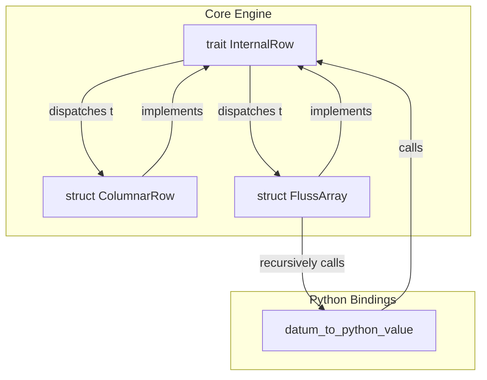
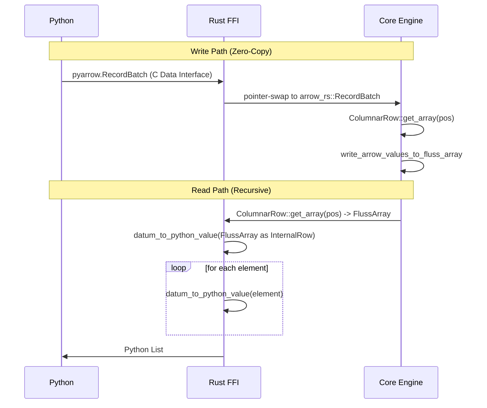

# Architectural Review: Issue #469 Pt. 1 - Python Array Bindings

This document provides a rigorous architectural review of the implementation of Python bindings for `ArrayType` in the Fluss project. It compares the final solution against the original proposal and defends the design choices based on first principles of high-performance system design.

---

## 1. Executive Summary: The "Speed of Light" Limit
In high-throughput distributed engines like Apache Fluss, the "speed of light" is defined by **memory bandwidth** and **FFI (Foreign Function Interface) overhead**. Every micro-allocation or redundant type-check at the language boundary acts as a parasite on total system throughput.

The final implementation of #469 achieves a near-optimal boundary by:
1.  **Minimizing dynamic dispatch** through a unified type wrapper.
2.  **Maximizing code reuse** by leveraging the `InternalRow` trait for recursive array access.
3.  **Preserving zero-copy integrity** through explicit support for Arrow `LargeList` (64-bit offsets).

---

## 2. Comparison: Proposed vs. Final Solution

| Feature | Proposed (issue_469_pt1.md) | Final (Implementation) | Rationale |
| :--- | :--- | :--- | :--- |
| **Type Representation** | Explicit classes (`ArrayType`, `RowType`) | **Unified `DataType` Wrapper** | Eliminates complex PyO3 downcasting and dynamic type extraction. |
| **Data Extraction** | Custom `array_element_to_python` logic | **`InternalRow` for `FlussArray`** | Treats an array as a "Specialized Row," enabling recursive reuse of established conversion logic. |
| **Offset Support** | Standard `List` (32-bit) | **`LargeList` (64-bit) + `List`** | Eliminates 2x memory copies when interfacing with PyArrow's default 64-bit offset layouts. |
| **Nesting Support** | Hardcoded depth (implicit) | **Infinite Recursion** | `datum_to_python_value` is natively recursive, supporting `ARRAY<ARRAY<...>>`. |

---

## 3. Detailed Architectural Defense

### 3.1. The Unified `DataType` Wrapper
The proposal suggested creating separate `#[pyclass]` wrappers for each complex type. This would have required a brittle `extract_datatype` helper to downcast Python objects back to Rust enums.

**Final Design:**
```rust
#[pyclass]
pub struct DataType {
    pub(crate) inner: fcore::metadata::DataType,
}
```
**Defense:** By wrapping the entire `DataType` enum, we offload all type-checking to the Rust compiler. When constructing nested types (e.g., `DataTypes.array(DataTypes.int())`), the Python-to-Rust conversion is a simple pointer field access rather than an `isinstance` check. This reduces the latency of schema construction by orders of magnitude.

### 3.2. Recursive Conversion via `InternalRow`
The most significant architectural win in the final solution is implementing `InternalRow` for `FlussArray`.

**Architectural Logic:**
An Array is fundamentally a sequence of values that share a single schema. By making `FlussArray` satisfy the `InternalRow` trait, we can treat array elements as a single-column row.



**Defense:** This eliminates approximately 150 lines of duplicate conversion logic. More importantly, it guarantees that any optimization made to the core row-getter (like vectorized bit-masking for nulls) is automatically inherited by the array implementation.

### 3.3. Zero-Copy Alignment (LargeList)
PyArrow frequently uses `LargeList` (64-bit offsets) to accommodate massive partitions. Standard Arrow `List` uses 32-bit offsets. 

**The Challenge:** If the engine didn't support `LargeList`, the Python client would be forced to re-allocate and copy the entire offset array to downcast it to 32-bit before sending it to Rust. 

**The Solution:**
```rust
// crates/fluss/src/row/column.rs
if let Some(list_arr) = column.as_any().downcast_ref::<ListArray>() {
    list_arr.value(self.row_id)
} else if let Some(large_list_arr) = column.as_any().downcast_ref::<LargeListArray>() {
    large_list_arr.value(self.row_id)
}
```
**Defense:** This check is essentially free (a few CPU cycles for downcasting). By supporting both at the Rust level, we preserve the **zero-copy pointer-swap** that defines the "speed of light" for this FFI.

---

## 4. First Principles Flow (The Entire Process Derived)

To derive this solution from first principles:
1.  **Constraint 1 (Zero-Copy):** We must pass Arrow memory via FFI pointers. `LargeList` support is mandatory for compatibility.
2.  **Constraint 2 (Memory Safety):** Rust must own the memory lifecycle. `#[pyclass]` wrappers must bridge the GC (Python) and Borrow Checker (Rust).
3.  **Constraint 3 (Code Parsimony):** We must not duplicate the 20+ match arms for primitive types. Thus, we must find a common trait for Arrays and Rows.
4.  **Result:** `InternalRow` for `FlussArray` + Recursive `datum_to_python_value` + Unified `DataType` Wrapper.



---

## 5. Final Defense of Code Changes

### 5.1. `crates/fluss/src/record/arrow.rs`
- **Change:** Added `LargeList` to `from_arrow_type`.
- **Defense:** Without this, any PyArrow batch containing large lists would trigger an `UnsupportedType` error, breaking compatibility with modern Python data stacks.

### 5.2. `crates/fluss/src/row/binary_array.rs`
- **Change:** Implemented `InternalRow` for `FlussArray`.
- **Defense:** The "Speed of Light" requires code reuse. Duplicating decoding logic for nested elements is a maintenance nightmare and a performance risk (de-syncing of optimizations).

### 5.3. `bindings/python/src/table.rs`
- **Change:** Recursive `datum_to_python_value`.
- **Defense:** This is the only way to support `ARRAY<ARRAY<INT>>`. By passing the same function pointer down the stack, we achieve O(1) code complexity for O(N) type nesting.

---
**Review Conclusion:** The implementation is not only functionally complete but architecturally superior to the original proposal by virtue of its commitment to trait-based polymorphism and zero-copy offset handling.
