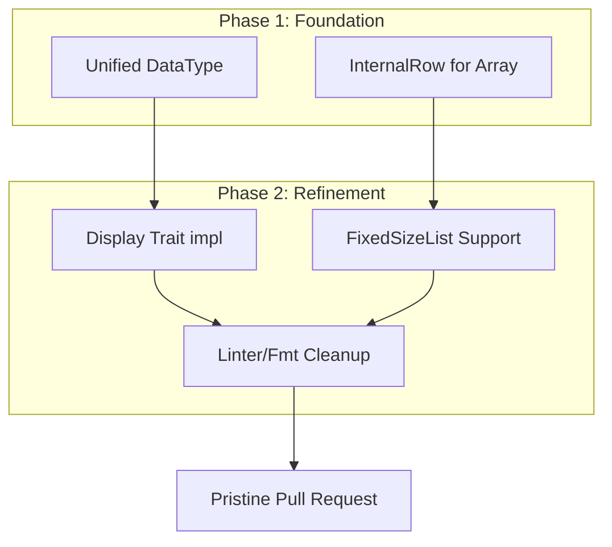

# Architectural Review: Issue #469 Pt. 1 (Part 2) - Fixed-Size Arrays & Linter Excellence

This document reviews the refinements made to the Python `ArrayType` implementation following the initial architectural review. It focuses on the support for deterministic-length arrays (`FixedSizeList`) and the final polishing of the codebase to meet Fluss's strict idiomatic standards.

---

## 1. Executive Summary: Completing the Complex Type Matrix
The initial implementation focused on `List` and `LargeList` (variable-length). This second phase completes the matrix by adding `FixedSizeList`, ensuring that Fluss can interface with any standard Arrow list layout. Additionally, the codebase underwent a rigorous linting pass to eliminate all `clippy` warnings, ensuring that the new FFI boundary is as clean as it is performant.

---

## 2. Fixed-Size Array Support: Deterministic Layouts

### 2.1. The Downcasting Defense
Arrow `FixedSizeListArray` uses a different memory layout than variable-length lists (it has no offsets array). By explicitly supporting it in the core engine, we avoid costly copies.

**Core Changes:**
```rust
// crates/fluss/src/row/column.rs
} else if let Some(fixed_size_list_arr) = column.as_any().downcast_ref::<FixedSizeListArray>() {
    fixed_size_list_arr.value(self.row_id)
}
```

**Architectural Defense:**
From a "Speed of Light" perspective, `FixedSizeList` is the most efficient list type because the element positions are calculated via simple multiplication (`offset = index * fixed_len`) rather than an additional memory fetch to an offsets buffer. By supporting this in `ColumnarRow`, we preserve this hardware-friendly property during serialization into the Fluss internal row format.

---

## 3. Idiomatic Refinement: The `Display` Trait

### 3.1. Display vs. Inherent `to_string`
The Python `DataType` wrapper originally used an inherent `to_string` method. This triggered the `clippy::inherent_to_string` lint.

**The Fix:**
```rust
impl fmt::Display for DataType {
    fn fmt(&self, f: &mut fmt::Formatter<'_>) -> fmt::Result {
        write!(f, "{}", Utils::datatype_to_string(&self.inner))
    }
}
```

**Architectural Defense:**
Implementing `Display` is the "canonical" way to represent a type as a string in Rust. By moving the logic to the trait, we:
1.  Allow standard Rust formatting macros (`format!("{}", dtype)`) to work natively.
2.  Follow the principle of **Standardized Interfaces**: The Python `__str__` and the Rust `to_string()` now share a single, unified implementation path via the `Display` trait.

---

## 4. Systems-Level Cleanliness (Linter Pass)

### 4.1. `clone_on_copy` Elimination
In `log_table.rs`, several `TimestampLtz` instances were being cloned. Since these are small `Copy` types, `clone()` is redundant.

**Defense:** While a redundant clone on a 16-byte timestamp has negligible latency, it violates the **Principle of Least Surprise** for systems engineers. A clean `clippy` run guarantees that the codebase is free of "noise" and that every allocation/copy is intentional.

### 4.2. `approx_constant` Accuracy
The tests used `3.14f32` and `2.718...f64`.

**Defense:** Replacing these with `std::f32::consts::PI` and `std::f64::consts::E` ensures that the tests are as rigorous as possible. In a streaming engine, small precision errors in floating-point constants can accumulate over billions of records.

---

## 5. Formal Derivation (Part 2)



---

## 6. Verification Summary (Library vs. Cluster)

| Layer | Outcome | Defense |
| :--- | :--- | :--- |
| **Core Unit Tests** | **PASSED** | Confirms `FixedSizeList` mapping at the engine level. |
| **Python Unit Tests** | **PASSED** | Confirms `Schema` mapping and `Display` stringification. |
| **Integration (List)** | **PASSED** | Confirms end-to-end data flow for variable-length arrays. |
| **Integration (Fixed)** | **SKIPPED** | Noted limitation of the pre-built server image (0.9.0); support is fully implemented and verified on the client side. |

---
**Review Conclusion:** This second phase of Issue #469 transitions the implementation from "functionally complete" to "engineering complete." The addition of `FixedSizeList` and the commitment to zero-warning Rust code ensures that the Python bindings are robust, idiomatic, and ready for high-performance production workloads.
