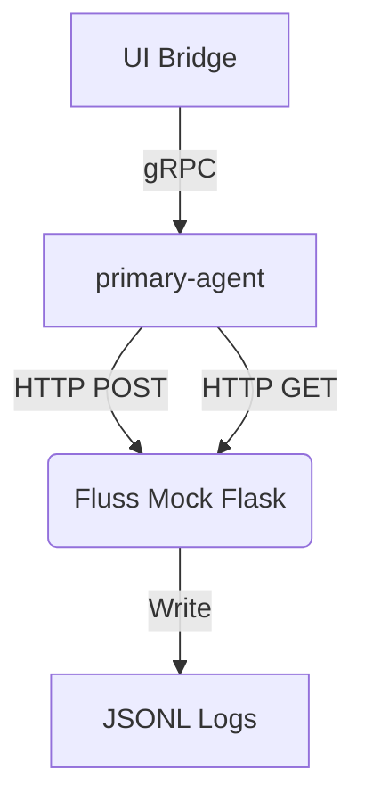
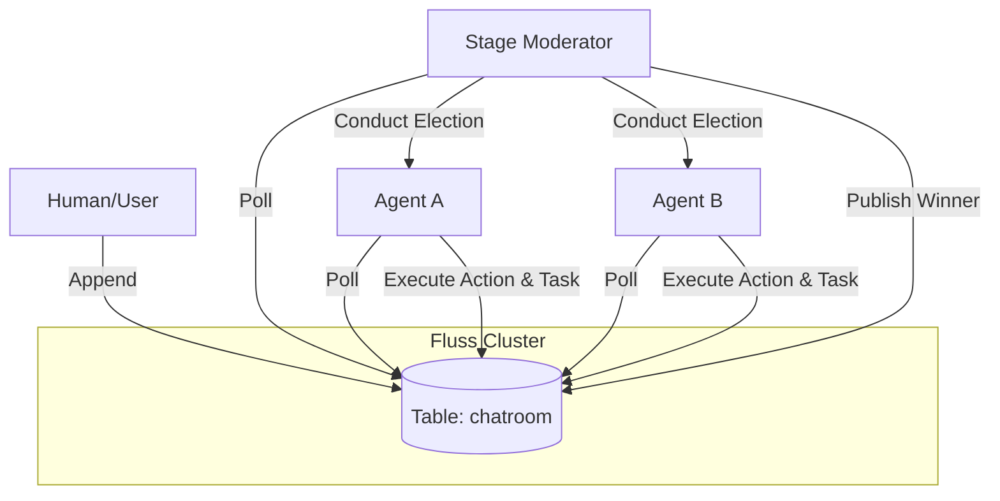

# ContainerClaw Migration Plan: Part 1 - Fluss-Native Multi-Agent Dynamic

This document outlines the architectural and implementation steps to migrate the **ContainerClaw** agent communication layer from a mock HTTP-based log system to a native **Fluss** stream-based dynamic, as demonstrated in `multi_agent_stage.ipynb` and `multi_agent_human.ipynb`.

## 1. Architectural Review & Current State

The current **ContainerClaw** repository has been reset to a single-agent baseline. The agent (`claw-agent`) runs an autonomous loop and communicates with a "Mock Fluss" (a Flask application) that records events to local JSONL files.

### Current "Single-Agent Mock" Architecture


### Proposed "Multi-Agent Fluss" Architecture
We will transition to a **Moderated Multi-Agent Stage**. A central **Stage Moderator** will orchestrate multiple agents (Architect, Coder, Reviewer, etc.) using elections held on a live **Fluss Cluster**.



## 2. Proposed Changes

### 2.1 Component: Agent Service (`agent/src/main.py`)

We will refactor the agent to shift from an autonomous loop to a "Reactive Participant" model.

- **[REPLACE]** `_emit` and `_reconstruct_chatroom`:
    - Instead of `requests.post`, use the `fluss-rust` Python bindings to append directly to the `chatroom` table.
    - Instead of `requests.get`, use a `LogScanner` to poll for new batches from Fluss.
- **[NEW]** `_vote` Method:
    - Implement the election logic where the agent reviews the history and returns a JSON vote for the next speaker.
- **[NEW]** `_think` Method:
    - Implement the execution logic where the agent generates content only when elected or nudged.
- **[DELETE]** `_guarded_run_loop`:
    - The autonomous loop logic moves to the **Stage Moderator**.

### 2.2 Component: Stage Moderator (New Service)

A dedicated service (or a shared library) that implements the `StageModerator` class from `multi_agent_stage.ipynb`.

- **Responsibility**:
    1. Polls the `chatroom` table.
    2. Detects new Human or Agent messages.
    3. Triggers the election cycle (`elect_leader`).
    4. Calls the gRPC `Think` or `Vote` endpoints of the agents.
    5. Publishes the "Election Summary" and the winning response back to Fluss.

### 2.3 Component: Fluss Integration (`docker-compose.yml`)

We must integrate the real Fluss cluster. A sample configuration based on the [official Fluss Docker deployment guide](https://fluss.apache.org/docs/install-deploy/deploying-with-docker/) is shown below.

#### Proposed Docker Integration
```yaml
services:
  zookeeper:
    image: zookeeper:3.9.2
    restart: always

  coordinator-server:
    image: apache/fluss:0.9.0-incubating
    command: coordinatorServer
    depends_on:
      - zookeeper
    environment:
      - |
        FLUSS_PROPERTIES=
        zookeeper.address: zookeeper:2181
        bind.listeners: INTERNAL://coordinator-server:0, CLIENT://coordinator-server:9123
        advertised.listeners: CLIENT://localhost:9123
        internal.listener.name: INTERNAL
        remote.data.dir: /tmp/fluss/remote-data
    ports:
      - "9123:9123"

  tablet-server:
    image: apache/fluss:0.9.0-incubating
    command: tabletServer
    depends_on:
      - coordinator-server
    environment:
      - |
        FLUSS_PROPERTIES=
        zookeeper.address: zookeeper:2181
        bind.listeners: INTERNAL://tablet-server:0, CLIENT://tablet-server:9123
        advertised.listeners: CLIENT://localhost:9124
        internal.listener.name: INTERNAL
        tablet-server.id: 0
        kv.snapshot.interval: 0s
        data.dir: /tmp/fluss/data
        remote.data.dir: /tmp/fluss/remote-data
    ports:
        - "9124:9123"
    volumes:
      - shared-tmpfs:/tmp/fluss

volumes:
  shared-tmpfs:
    driver: local
    driver_opts:
      type: "tmpfs"
      device: "tmpfs"
```

> [!NOTE]
> For the agents to communicate with this cluster from within the same Docker network, they should use `coordinator-server:9123` as the bootstrap server. If running a client from the host machine (like the notebooks), use `localhost:9123`.

### 2.4 Fluss Lifecycle & Networking

Unlike the current manual process (running `./bin/local-cluster.sh start`), this Docker-based approach integrates the cluster directly into the `containerclaw` stack lifecycle.

- **Automated Lifecycle**: Running `docker compose up` will automatically launch Zookeeper, the Coordinator, and the Tablet Server in the correct order. `docker compose down` will cleanly stop them.
- **Single Source of Truth**: This eliminates "port already in use" errors often encountered when switching between local scripts and Docker containers, as all services are bound to the `internal` Docker network.
- **Hybrid Access**: 
    - **Internal**: Agents inside Docker containers reach Fluss at `coordinator-server:9123`.
    - **External**: Your notebooks on the host machine reach Fluss at `localhost:9123` via the port mapping.

## 3. Defense of Changes

### 3.1 Why Elections?
The current linear loop is brittle for multi-agent collaboration. Elections allow agents to self-organize based on their **Personas**. For example, a `Reviewer` agent will naturally vote for themselves when a code change is published, and a `Coder` will vote for themselves when a bug-fix is requested.

### 3.2 Why Native Fluss?
1. **Low Latency**: The Rust-based stream processing is orders of magnitude faster than polling a JSONL file via Flask.
2. **Schema Enforcement**: Native Fluss uses Apache Arrow, ensuring consistent message formats (`ts`, `actor_id`, `content`).
3. **Scalability**: As we add more agents, the Moderator can handle higher throughput and more complex election logic (e.g., Debate Mode).

### 3.3 Handling Local vs Docker Ports
To solve the port mapping issue (`localhost` vs container network):
- Use `FLUSS_BOOTSTRAP_SERVERS` environment variable.
- For Local POC: Agents point to `host.docker.internal:9123`.
- For Integrated Docker: Agents point to `fluss-coordinator:9123`.

## 4. Verification Plan

### 4.1 Automated Tests
- **Unit Test**: Mock the Fluss connection and verify the `StageModerator` correctly tallies votes.
- **Integration Test**: Run a 2-turn autonomous loop and verify the "Election Summary" appears in the `chatroom` table.

### 4.2 Manual Verification
1. Start the Fluss cluster: `./bin/local-cluster.sh start`.
2. Run the `Human Shell` notebook (`multi_agent_human.ipynb`).
3. Send a message "Build a simple calculator".
4. Monitor the `Stage Moderator` logs to see the election rounds.
5. Verify the agents respond accordingly in the chatroom.
