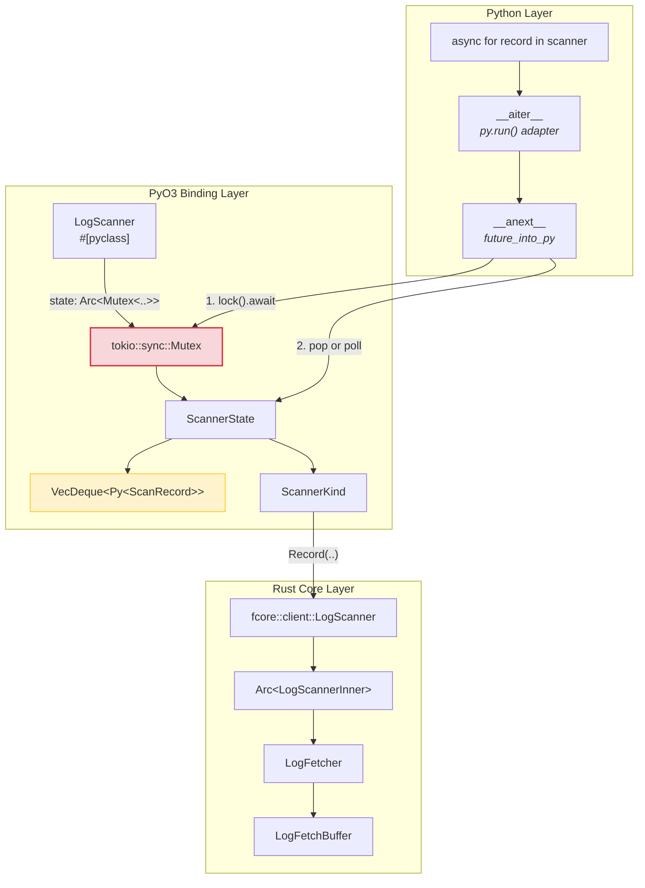
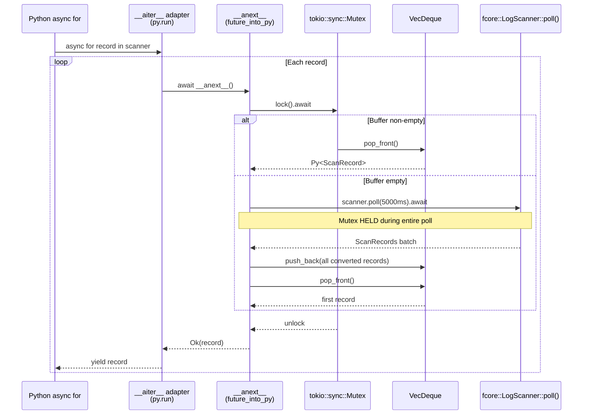
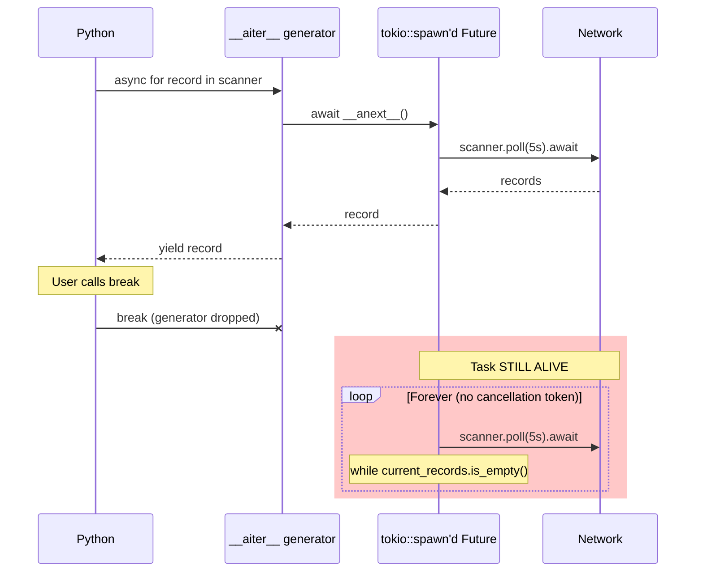
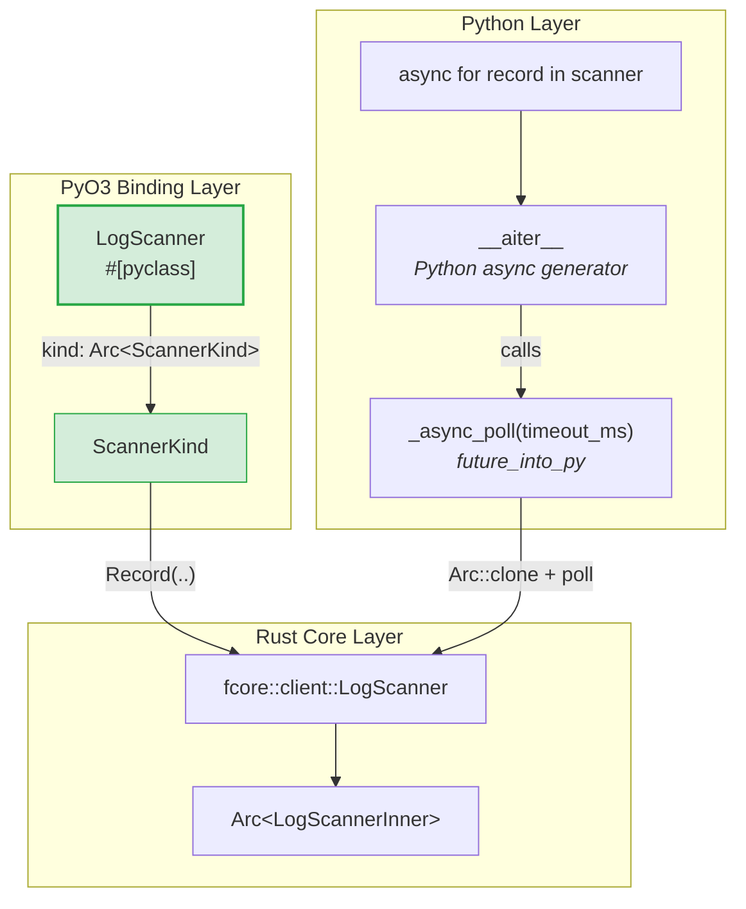
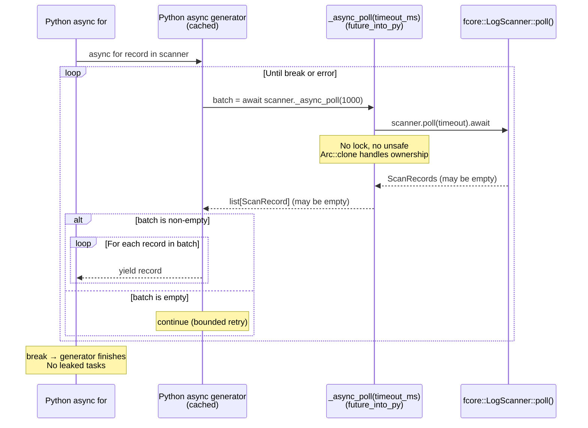
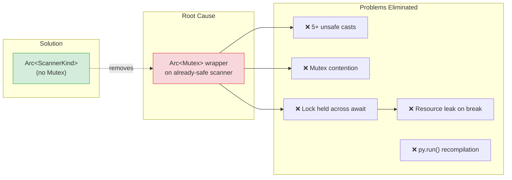
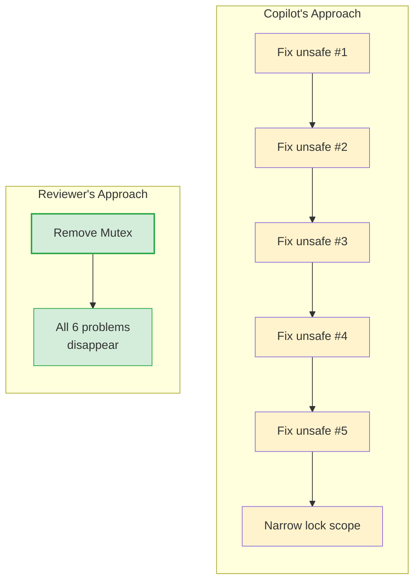

# PR #438 Review: Architectural Analysis & Proposed Refactoring

> Response to [fresh-borzoni's review](https://github.com/apache/fluss-rust/pull/438#issuecomment-4039011485) and GitHub Copilot's 11 inline suggestions on `feat: add async 'for' loop support to LogScanner (#424)`.

---

## Table of Contents

1. [Executive Summary](#1-executive-summary)
2. [Current Architecture (As Submitted)](#2-current-architecture-as-submitted)
3. [Reviewer Critique: Point-by-Point Analysis](#3-reviewer-critique-point-by-point-analysis)
4. [Proposed Architecture (Refactored)](#4-proposed-architecture-refactored)
5. [Code Change Defense: Exhaustive Breakdown](#5-code-change-defense-exhaustive-breakdown)
6. [Copilot Suggestions: Triage](#6-copilot-suggestions-triage)
7. [Verification Plan](#7-verification-plan)

---

## 1. Executive Summary

The reviewer's core argument is correct: the `tokio::sync::Mutex` wrapper around `ScannerState` is **architecturally unnecessary** and introduces cascading complexity (5 `unsafe` pointer casts, lock contention on every sync call, and a resource leak on `break` from `async for`).

### Root Cause

The fundamental mistake was misidentifying *where* thread-safety enforcement belongs. The core Rust `LogScanner` ([scanner.rs:257](file:///Users/jaredyu/Desktop/open_source/fluss-rust/crates/fluss/src/client/table/scanner.rs#L257)) already stores its state behind `Arc<LogScannerInner>` and exposes all methods via `&self`:

```rust
// crates/fluss/src/client/table/scanner.rs
pub struct LogScanner {
    inner: Arc<LogScannerInner>,  // Already thread-safe
}

impl LogScanner {
    pub async fn poll(&self, timeout: Duration) -> Result<ScanRecords> { ... }
    pub async fn subscribe(&self, bucket: i32, offset: i64) -> Result<()> { ... }
    // All methods take &self — no &mut self anywhere
}
```

The `Arc<Mutex<ScannerState>>` in the Python binding was a **redundant second layer** of synchronization that created problems the `unsafe` casts then "solved."

### The Fix (Reviewer's Proposal)

Store the scanner in a bare `Arc<ScannerKind>` (no Mutex), add a bounded `_async_poll(timeout_ms)` method, and implement `__aiter__` as a small Python async generator. This eliminates all `unsafe`, all Mutex contention, and all resource leaks.

---

## 2. Current Architecture (As Submitted)

### 2.1 Component Layout



### 2.2 Data Flow Through `__anext__`



### 2.3 Identified Problems

| # | Problem | Severity | Root Cause |
|---|---------|----------|------------|
| 1 | **5 `unsafe` pointer casts** in sync methods (`poll`, `poll_record_batch`, `poll_arrow`, `to_arrow.query_latest_offsets`, `poll_until_offsets`) | 🔴 Critical | Borrow checker rejects `self.state.lock()` inside `block_on` because `&self` doesn't outlive the `'static` future boundary |
| 2 | **Mutex held across `await`** in `__anext__` — blocks ALL other methods for entire network RTT | 🔴 Critical | Lock acquired at line 2254, held through `scanner.poll(timeout).await` and the retry loop |
| 3 | **Resource leak on `break`** — `future_into_py` spawns a tokio task that loops forever polling the network | 🟡 High | `while current_records.is_empty()` inside a spawned future has no cancellation mechanism |
| 4 | **`py.run()` on every `async for`** — recompiles the Python adapter function each iteration start | 🟡 Medium | No caching of the compiled adapter |
| 5 | **Batch scanner treated as StopAsyncIteration** — silently ends iteration instead of raising `TypeError` | 🟡 Medium | `match state.kind.as_record()` Err branch mapped to wrong exception |

---

## 3. Reviewer Critique: Point-by-Point Analysis

### 3.1 "The scanner is already thread-safe internally (`&self` on all methods)"

**Verdict: ✅ Correct.**

Evidence from [scanner.rs:256-563](file:///Users/jaredyu/Desktop/open_source/fluss-rust/crates/fluss/src/client/table/scanner.rs#L256-L563):

```rust
pub struct LogScanner {
    inner: Arc<LogScannerInner>,  // Arc provides shared ownership
}

// ALL public methods take &self, not &mut self:
impl LogScanner {
    pub async fn poll(&self, ...)              -> Result<ScanRecords> { ... }
    pub async fn subscribe(&self, ...)         -> Result<()> { ... }
    pub async fn subscribe_buckets(&self, ...) -> Result<()> { ... }
    pub async fn unsubscribe(&self, ...)       -> Result<()> { ... }
    // ... 7 more &self methods
}
```

The `LogScannerInner` achieves internal thread safety through:
- `LogFetchBuffer`: uses internal `Mutex` + `Condvar` for producer/consumer synchronization
- `LogScannerStatus`: uses internal `parking_lot::Mutex` for subscription state
- `Metadata`: uses `RwLock` for cached cluster topology

**Conclusion**: Adding `tokio::sync::Mutex` at the Python binding layer is double-locking. The core already guarantees safety for concurrent `&self` calls.

### 3.2 "The Mutex forces 5 unsafe pointer casts to work around borrow issues it created"

**Verdict: ✅ Correct.**

The `unsafe` casts exist at these locations:

| Location | Line | Method |
|----------|------|--------|
| [table.rs:2044-2046](file:///Users/jaredyu/Desktop/open_source/fluss-rust/bindings/python/src/table.rs#L2044-L2046) | 2044 | `poll()` |
| [table.rs:2096-2098](file:///Users/jaredyu/Desktop/open_source/fluss-rust/bindings/python/src/table.rs#L2096-L2098) | 2096 | `poll_record_batch()` |
| [table.rs:2134-2136](file:///Users/jaredyu/Desktop/open_source/fluss-rust/bindings/python/src/table.rs#L2134-L2136) | 2134 | `poll_arrow()` |
| [table.rs:2191-2193](file:///Users/jaredyu/Desktop/open_source/fluss-rust/bindings/python/src/table.rs#L2191-L2193) | 2191 | `to_arrow()` |
| [table.rs:2381-2382](file:///Users/jaredyu/Desktop/open_source/fluss-rust/bindings/python/src/table.rs#L2381-L2382) | 2381 | `query_latest_offsets()` |
| [table.rs:2487-2488](file:///Users/jaredyu/Desktop/open_source/fluss-rust/bindings/python/src/table.rs#L2487-L2488) | 2487 | `poll_until_offsets()` |

All 6 instances follow the same pattern:
```rust
let scanner_ref = unsafe {
    &*(&self.state as *const std::sync::Arc<tokio::sync::Mutex<ScannerState>>)
};
let lock = TOKIO_RUNTIME.block_on(async { scanner_ref.lock().await });
```

**Why these exist**: `TOKIO_RUNTIME.block_on()` requires a `'static` future. A reference to `self.state` has lifetime `'_` (tied to `&self`), so the borrow checker rejects `self.state.lock()` inside `block_on`. The `unsafe` cast strips the lifetime, creating a raw pointer that is immediately re-referenced.

**Why they're wrong**: The `unsafe` blocks are not *unsound* per se (the GIL guarantees `self` stays alive), but they are **entirely unnecessary** — they only exist because the Mutex was introduced in the first place. Without the Mutex, these methods would directly call the core scanner (which takes `&self`) without any lifetime issues.

### 3.3 "The `anext` loop runs inside `tokio::spawn`, so breaking out of `async for` leaves it polling forever"

**Verdict: ✅ Correct.**



The `while current_records.is_empty()` loop at [table.rs:2282-2287](file:///Users/jaredyu/Desktop/open_source/fluss-rust/bindings/python/src/table.rs#L2282-L2287) has **no exit condition** other than receiving data or a network error. When the Python generator is garbage-collected after `break`, the spawned tokio task continues to hold:
- An `Arc` reference to the `ScannerState` (preventing cleanup)
- An active network polling loop (consuming server resources)
- A lock acquisition attempt on every iteration (blocking other callers)

### 3.4 "Simpler idea: store the scanner in an Arc, keep existing methods as-is"

**Verdict: ✅ This is the correct approach.** Detailed design in §4.

---

## 4. Proposed Architecture (Refactored)

### 4.1 High-Level Design



### 4.2 Key Structural Changes

| Aspect | Before (Submitted) | After (Proposed) |
|--------|-------------------|------------------|
| Scanner storage | `Arc<tokio::sync::Mutex<ScannerState>>` | `Arc<ScannerKind>` (no Mutex) |
| Buffer storage | `VecDeque<Py<ScanRecord>>` inside `ScannerState` | None — `_async_poll` returns a `list` |
| `__aiter__` | `py.run()` to compile Python adapter | Return cached Python async generator |
| `__anext__` | Rust `future_into_py` with lock + loop | Eliminated — generator calls `_async_poll` |
| Sync methods | `unsafe` pointer cast + `block_on(lock)` | Direct `&self` access (no lock needed) |
| Break behavior | Leaked tokio task loops forever | Generator exits naturally, no task to leak |

### 4.3 Data Flow (Refactored)



### 4.4 Why This Eliminates All Problems



---

## 5. Code Change Defense: Exhaustive Breakdown

### 5.1 Remove `ScannerState` and `tokio::sync::Mutex`

**What changes**:
```diff
 #[pyclass]
 pub struct LogScanner {
-    state: Arc<tokio::sync::Mutex<ScannerState>>,
+    kind: Arc<ScannerKind>,
     admin: fcore::client::FlussAdmin,
     table_info: fcore::metadata::TableInfo,
     projected_schema: SchemaRef,
     projected_row_type: fcore::metadata::RowType,
     partition_name_cache: std::sync::RwLock<Option<HashMap<i64, String>>>,
 }
-
-struct ScannerState {
-    kind: ScannerKind,
-    pending_records: std::collections::VecDeque<Py<ScanRecord>>,
-}
```

**Defense**:
1. `ScannerKind` wraps either `fcore::client::LogScanner` or `fcore::client::RecordBatchLogScanner`. Both are `Send + Sync` because they internally use `Arc<LogScannerInner>`.
2. `Arc<ScannerKind>` provides the shared ownership needed for `future_into_py` closures (which require `'static`) — `Arc::clone()` before moving into the future.
3. The `VecDeque` buffer is eliminated because `_async_poll` returns an entire batch as a Python `list`. The Python async generator handles per-record iteration.

### 5.2 Replace All `unsafe` Sync Methods with Direct `&self` Access

**What changes** (applied uniformly to `poll`, `poll_record_batch`, `poll_arrow`, `to_arrow`, `query_latest_offsets`, `poll_until_offsets`):

```diff
 fn poll(&self, py: Python, timeout_ms: i64) -> PyResult<ScanRecords> {
-    let scanner_ref =
-        unsafe { &*(&self.state as *const std::sync::Arc<tokio::sync::Mutex<ScannerState>>) };
-    let lock = TOKIO_RUNTIME.block_on(async { scanner_ref.lock().await });
-    let scanner = lock.kind.as_record()?;
+    let scanner = self.kind.as_record()?;
     // ... rest unchanged
 }
```

**Defense**:
1. The `unsafe` cast was only needed because `block_on(async { self.state.lock().await })` requires a `'static` future, and `&self` is not `'static`. Without the Mutex, there is no `lock().await`, so no `'static` bound is needed.
2. `self.kind.as_record()` returns `&fcore::client::LogScanner` which is valid for the duration of `&self`. The subsequent `py.detach(|| TOKIO_RUNTIME.block_on(...))` is safe because `py.detach` releases the GIL and blocks the current OS thread — `self` cannot be dropped while the thread is blocked.
3. This matches the existing pattern used by `subscribe`, `subscribe_buckets`, etc., which already access `self.state.lock()` safely via `py.detach()`.

### 5.3 Replace `__anext__` with `_async_poll`

**What changes**:
```diff
-fn __anext__<'py>(slf: PyRefMut<'py, Self>) -> PyResult<Option<Bound<'py, PyAny>>> {
-    let state_arc = slf.state.clone();
-    let projected_row_type = slf.projected_row_type.clone();
-    let py = slf.py();
-    let future = future_into_py(py, async move {
-        let mut state = state_arc.lock().await;
-        // ... 50+ lines of lock-holding, looping, buffering logic
-    })?;
-    Ok(Some(future))
-}

+/// Single bounded poll that returns a list of records.
+/// Used by the Python async generator to implement async for.
+fn _async_poll<'py>(&self, py: Python<'py>, timeout_ms: i64) -> PyResult<Bound<'py, PyAny>> {
+    let scanner = Arc::clone(&self.kind);
+    let projected_row_type = self.projected_row_type.clone();
+    let timeout = Duration::from_millis(timeout_ms as u64);
+
+    future_into_py(py, async move {
+        let core_scanner = match scanner.as_ref() {
+            ScannerKind::Record(s) => s,
+            ScannerKind::Batch(_) => {
+                return Err(PyTypeError::new_err(
+                    "Async iteration is only supported for record scanners; \
+                     use create_record_log_scanner() instead."
+                ));
+            }
+        };
+
+        let scan_records = core_scanner
+            .poll(timeout)
+            .await
+            .map_err(|e| FlussError::from_core_error(&e))?;
+
+        // Convert to Python list
+        Python::attach(|py| {
+            let mut result = Vec::new();
+            for (_, records) in scan_records.into_records_by_buckets() {
+                for core_record in records {
+                    let scan_record = ScanRecord::from_core(py, &core_record, &projected_row_type)?;
+                    result.push(Py::new(py, scan_record)?);
+                }
+            }
+            Ok(result)
+        })
+    })
+}
```

**Defense**:

| Property | `__anext__` (before) | `_async_poll` (after) |
|----------|---------------------|----------------------|
| Lock held during I/O | Yes (entire poll duration) | No lock at all |
| Cancellation safe | ❌ (spawned task loops forever) | ✅ (single bounded poll, returns immediately) |
| Break behavior | Leaked task | Generator exits, no task |
| Error on batch scanner | `StopAsyncIteration` (wrong) | `TypeError` (correct) |
| Complexity | ~55 lines, 3 nested async contexts | ~25 lines, single future |

### 5.4 Replace `__aiter__` with Cached Python Async Generator

**What changes**:
```diff
-fn __aiter__<'py>(slf: PyRef<'py, Self>) -> PyResult<Bound<'py, PyAny>> {
-    let py = slf.py();
-    let code = pyo3::ffi::c_str!(
-        r#"
-async def _adapter(obj):
-    while True:
-        try:
-            yield await obj.__anext__()
-        except StopAsyncIteration:
-            break
-"#
-    );
-    let globals = pyo3::types::PyDict::new(py);
-    py.run(code, Some(&globals), None)?;
-    let adapter = globals.get_item("_adapter")?.unwrap();
-    adapter.call1((slf.into_bound_py_any(py)?,))
-}

+// Module-level cached generator function
+static ASYNC_GEN_FN: PyOnceLock<Py<PyAny>> = PyOnceLock::new();
+
+fn __aiter__<'py>(slf: PyRef<'py, Self>) -> PyResult<Bound<'py, PyAny>> {
+    let py = slf.py();
+    let gen_fn = ASYNC_GEN_FN.get_or_init(py, || {
+        let code = pyo3::ffi::c_str!(
+            r#"
+async def _async_scan(scanner, timeout_ms=1000):
+    while True:
+        batch = await scanner._async_poll(timeout_ms)
+        if batch:
+            for record in batch:
+                yield record
+"#
+        );
+        let globals = pyo3::types::PyDict::new(py);
+        py.run(code, Some(&globals), None).unwrap();
+        globals.get_item("_async_scan").unwrap().unwrap().unbind()
+    });
+    gen_fn.bind(py).call1((slf.into_bound_py_any(py)?,))
+}
```

**Defense**:

1. **`PyOnceLock` caching**: The adapter function is compiled exactly once per interpreter lifetime, not once per `async for` call. This eliminates the `py.run()` overhead flagged by Copilot.

2. **Bounded poll semantics**: The generator calls `_async_poll(timeout_ms)` which does a single bounded poll. If it returns an empty list (timeout), the generator just loops and tries again. When the user calls `break`, the generator exits naturally — no spawned task, no leaked resources.

3. **`StopAsyncIteration` compliance**: The generator is a *real* Python `async def ... yield` generator, so CPython's own interpreter handles the protocol correctly. No adapter-wrapping-adapter indirection.

4. **Break safety**: When the user breaks out of `async for`:
   - The generator object is garbage-collected
   - No background tokio tasks are running (each `_async_poll` call completes before returning)
   - The `Arc<ScannerKind>` refcount decrements normally

### 5.5 Subscribe/Unsubscribe Methods — Keep As-Is

The existing `subscribe`, `subscribe_buckets`, etc., already use `py.detach()` correctly:

```rust
fn subscribe(&self, py: Python, bucket_id: i32, start_offset: i64) -> PyResult<()> {
    py.detach(|| {
        TOKIO_RUNTIME.block_on(async {
            let state = self.state.lock().await;
            with_scanner!(&state.kind, subscribe(bucket_id, start_offset))
                .map_err(|e| FlussError::from_core_error(&e))
        })
    })
}
```

**After refactoring** (no Mutex, no `with_scanner!` needed):

```diff
 fn subscribe(&self, py: Python, bucket_id: i32, start_offset: i64) -> PyResult<()> {
     py.detach(|| {
         TOKIO_RUNTIME.block_on(async {
-            let state = self.state.lock().await;
-            with_scanner!(&state.kind, subscribe(bucket_id, start_offset))
+            match self.kind.as_ref() {
+                ScannerKind::Record(s) => s.subscribe(bucket_id, start_offset).await,
+                ScannerKind::Batch(s) => s.subscribe(bucket_id, start_offset).await,
+            }
             .map_err(|e| FlussError::from_core_error(&e))
         })
     })
 }
```

> [!NOTE]
> The `with_scanner!` macro can be retained for convenience — it just needs to operate on `&self.kind` instead of `&state.kind`. The macro itself is not problematic.

---

## 6. Copilot Suggestions: Triage

| # | Copilot Suggestion | Verdict | Action |
|---|-------------------|---------|--------|
| 1 | Cache `__aiter__` adapter with `PyOnceLock` | ✅ Agree | Implemented in §5.4 via `ASYNC_GEN_FN: PyOnceLock` |
| 2 | Narrow Mutex critical section in `__anext__` | ⚪ Superseded | Entire Mutex is removed — no critical section exists |
| 3-4, 8-11 | Remove `unsafe` pointer casts (6 locations) | ✅ Agree | All eliminated by removing the Mutex (§5.2) |
| 5 | Raise `TypeError` instead of `StopAsyncIteration` for batch scanner | ✅ Agree | Implemented in `_async_poll` (§5.3) |
| 6 | Wrap long comment to 88 chars (Ruff E501) | ✅ Agree | Trivial formatting fix |
| 7 | Add test for batch scanner async iteration | ✅ Agree | Should assert `TypeError` is raised |

### Copilot Suggestions That Are Obviated

Suggestions 2-4 and 8-11 all target the `unsafe` casts and lock contention. The proposed refactoring **eliminates the root cause** rather than patching individual symptoms:



---

## 7. Verification Plan

### 7.1 Automated Tests

```bash
# Run existing integration tests (must pass unchanged)
cd bindings/python
pytest test/test_log_table.py -v

# Specifically test the async iterator
pytest test/test_log_table.py::test_async_iterator -v

# Run cargo tests
cargo test --all
```

### 7.2 New Tests to Add

1. **`test_async_iterator_break`**: Verify that breaking out of `async for` does not leak resources
2. **`test_async_iterator_batch_scanner_raises`**: Verify `TypeError` is raised when using `async for` with a batch scanner
3. **`test_sync_methods_unaffected`**: Verify `poll()`, `poll_arrow()`, `to_arrow()` work identically after removing the Mutex

### 7.3 Manual Verification

- Confirm no `unsafe` blocks remain in `table.rs` (except potentially the `py.run()` call itself, which is safe by PyO3 definition)
- Run `cargo clippy` to verify no new warnings
- Run `cargo fmt --all --check` to verify formatting

---

> [!IMPORTANT]
> **Summary of action items for the next commit**:
> 1. Replace `Arc<tokio::sync::Mutex<ScannerState>>` with `Arc<ScannerKind>`
> 2. Remove `ScannerState` struct and `VecDeque` buffer
> 3. Remove all 6 `unsafe` pointer casts
> 4. Replace `__anext__` with `_async_poll(timeout_ms)` (single bounded poll)
> 5. Replace `__aiter__` with `PyOnceLock`-cached Python async generator
> 6. Change batch scanner error from `StopAsyncIteration` to `TypeError`
> 7. Update `with_scanner!` macro or inline to use `&self.kind` directly
> 8. Add break-safety and batch-scanner-error tests
